# Arquitetura Corporativa

A Arquitetura Corporativa consiste no planejamento estruturado e à organização dos recursos de tecnologia de uma empresa, alinhando-os com seus objetivos de negócios e necessidades operacionais dentro de um ambiente de nuvem.

  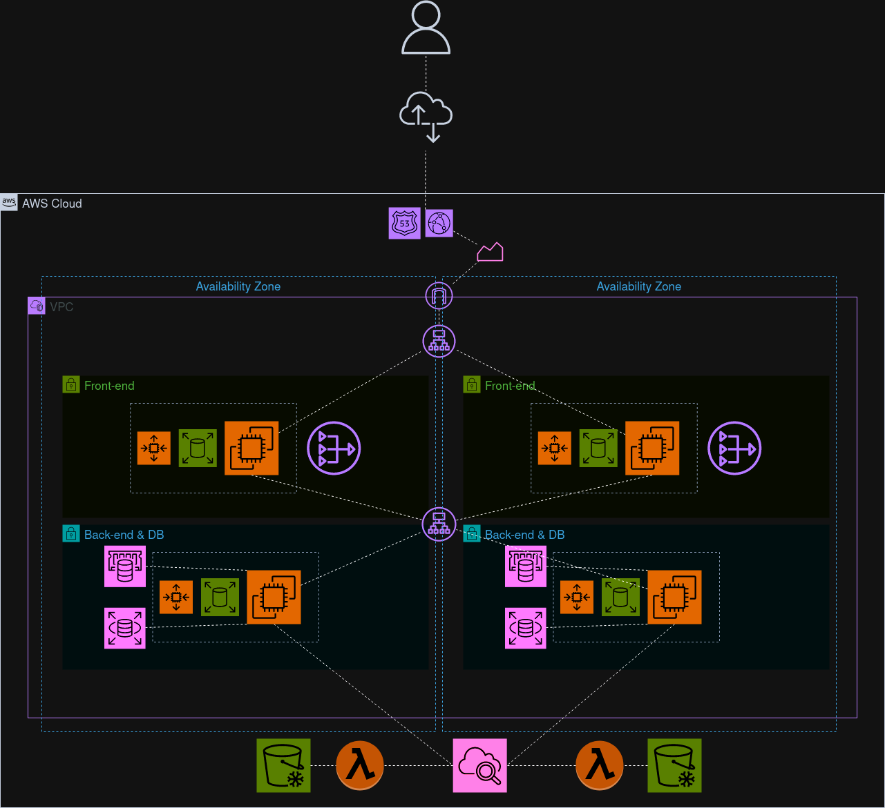

Arquitetura da Solução

## Componentes

### Usuário

Esse ícone representa o usuário final que irá utilizar-se da nossa aplicação. Ele se encontra fora da Cloud da AWS (Amazon Web Service) e conectará com a nossa aplicação por meio da Internet.

  

Ícone do Usuário

### Internet

A internet é uma vasta rede global de computadores e dispositivos interconectados que permite a comunicação e o compartilhamento de informações entre usuários de todo o mundo. No caso, ela será responsável pela comunicação entre o usuário e a nossa aplicação em nuvem.

  

Internet

### Route 53

O Amazon Route 53 é um serviço Web de Domain Name System (DNS) na nuvem dimensionável, projetado para oferecer uma maneira confiável de rotear usuários finais para aplicações da Internet. Ele converte nomes (como www.exemplo.com) em endereços IP numéricos (como 192.0.2.1) que os computadores usam para se conectarem entre si.

  

Route 53

### CloudFront

O Amazon CloudFront é um serviço rápido de rede de entrega de conteúdo (CDN) que entrega dados, vídeos, aplicativos e interfaces de programação de aplicativos (APIs) para clientes em todo o mundo, com baixa latência e altas velocidades de transferência. O CloudFront funciona por meio de uma rede global de pontos de presença localizado em diversas regiões do mundo, o que promove a capacidade de failover para a aplicação.

  

CloudFront

### Route 53 Health Check

O Route 53 Health Check é um serviço da AWS acoplado ao Route 53, ele é usado, unicamente, para monitorar a saúde e a disponibilidade de recursos. Portanto, se um recurso (exemplo: EC2) falhar em um health check, o Route 53 Health Check avisa o Route 53, o qual fica responsável por rotear o tráfego para longe das regiões não saudáveis, garantindo, assim, a alta disponibilidade e confiabilidade do projeto.

  

Route 53 Health Check

### Application Load Balancer 

O Elastic Load Balacing (ELB) é responsável por distribuir o tráfego de entrada entre vários destinos em uma única zona de disponibilidade ou em várias zonas de disponibilidade.

O Application Load Balancer é uma modalidade do ELB com o foco em aplicações. Ele escuta as portas de cada servidor para distribuir o tráfego entre os grupos de EC2 Auto Scaling, fazendo com que o consumo individual de recursos em cada instância seja reduzido.

  

Application Load Balancer

### Internet Gateway

O Internet Gateway é um serviço da AWS que permite a comunicação entre a VPC (Virtual Private Cloud) e a Internet, permitindo que a VPC envie ou receba dados da Internet.

  

Internet Gateway

### NAT

O NAT é um serviço da AWS que permite que instâncias em uma sub-rede privada se conectem à internet ou a outros serviços AWS, mas impede que o tráfego da Internet inicie uma conexão com essas instâncias.

  

NAT

### EC2

O Amazon Elastic Cloud Computing oferece a capacidade de computação redimensionável como máquinas virtuais na Nuvem, possibilitando, então, uma escalabilidade maior para a aplicação.

  

EC2

### EC2 Auto Scaling

O EC2 Auto Scaling é um serviço da AWS que permite ajustar automaticamente a quantidade de instâncias EC2 em funcionamento dentro de uma configuração de grupo de Auto Scaling para manter a performance e promover a elasticidade para a aplicação.

  

EC2 Auto Scaling

### RDS

O Amazon Relational Database Service (Amazon RDS) consiste em um RDBMS(Relational Databse Management System) que facilita a configuração, operação e escalabilidade de um banco de dados relacional na nuvem. Ele oferece capacidade escalável e automatiza tarefas demoradas de administração, como provisionamento de hardware, configuração de bancos de dados, aplicação de patches e backups.

  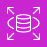

RDS

### ElastiCache

O Amazon ElastiCache é um serviço de armazenamento de dados em cache na memória oferecido pela Amazon Web Services (AWS). Ele é projetado para ajudar a melhorar a velocidade e a performance de aplicações baseadas na nuvem. 

  

ElastiCache

### CloudWatch

O Cloudwatch é um serviço oferecido pela AWS responsável por realizar o monitoramento de logs. Ele funciona por meio de um agente, o qual irá realizar a varredura de um determinado "path". Por exemplo: em um servidor httpd, o Cloudwatch pode realizar a leitura do arquivo access_Log que se encontra no "path": /var/log/httpd/access_log.

  

CloudWatch

### Lambda

O Lambda é um serviço oferecido pela AWS que permite executar código sem provisionar ou gerenciar servidores.

  

Lambda

### S3 Glacier

O Amazon S3 Glacier é um serviço de armazenamento de arquivos de baixo custo oferecido pela AWS, projetado para arquivamento de dados e backup de longo prazo. Dessa forma, o S3 Glacier é importante para dados que são acessados com menos frequência, mas que precisam ser armazenados de forma segura por períodos prolongados.

  

S3 GLacier

### Amazon Managed Grafana

O Amazon Managed Grafana é um serviço dedicado ao uso de um cliente Grafana gerenciado pela AWS. O Grafana é um serviço open source de analytics e monitoramento de soluções. Ele permite fazer requisições, visualizar e monitorar sistemas.

  

Amazon Managed Grafana

### Grafana Cloud K6

O Grafana Cloud K6 é um serviço criado pela Grafana Labs para testes de cargas em plataformas. Ele serve para prevenir falhas de sistema e trazer o conhecimento da robustez do mesmo

  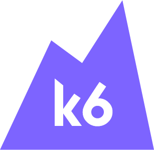

Grafana K6

## Camada da Arquitetura

Para facilitar a explicação do fluxo, é preciso entender que existem camadas (layers) na arquitetura. Dentre elas estão: AWS Cloud, VPC, Zonas de Disponibilidade (AZs), sub-rede pública e sub-rede privada.

### AWS Cloud

A camada da AWS Cloud engloba todos os serviços da AWS. Portanto, toda a arquitetura da aplicação está dentro desse grupo. Comparando com a arquitetura completa, os únicos componentes que não estão presentes na AWS Cloud são os usuários e a própria Internet.

  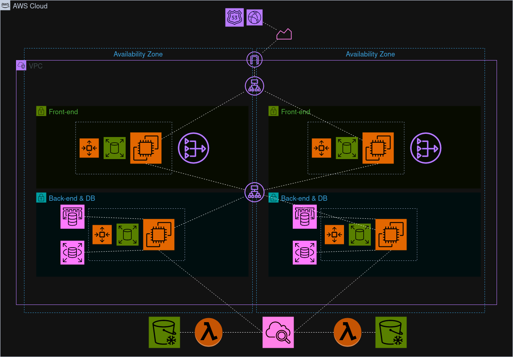

AWS Cloud

### Zona de Disponibilidade

As Zonas de Disponibilidade (AZs) na AWS são centros de dados de alta disponibilidade localizados dentro de regiões geográficas que compõem a infraestrutura da AWS Cloud. Cada Zona de Disponibilidade é uma entidade independente com sua própria fonte de alimentação, refrigeração e segurança física, o que as tornam importantes em casos de desastres. Elas São interconectadas através de redes de alta velocidade e baixa latência, permitindo que as aplicações operem de forma mais resiliente e segura.

Elas se encontram dentro do grupo da AWS Cloud, e dentro dessas Zonas, encontra-se a VPC (Virtual Private Cloud) e maior parte dos serviços utilizado na aplicação.

  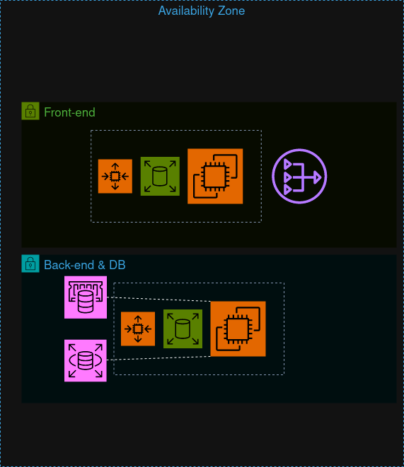

Zonas de Disponibilidade

### Virtual Private Cloud (VPC)

O Amazon VPC permite provisionar nuvens privadas virtuais. Uma VPC é uma rede virtual isolada logicamente de outras redes virtuais na nuvem AWS. As VPCs pertencem a uma única região da AWS e podem abranger mais de uma zona de disponibilidade

  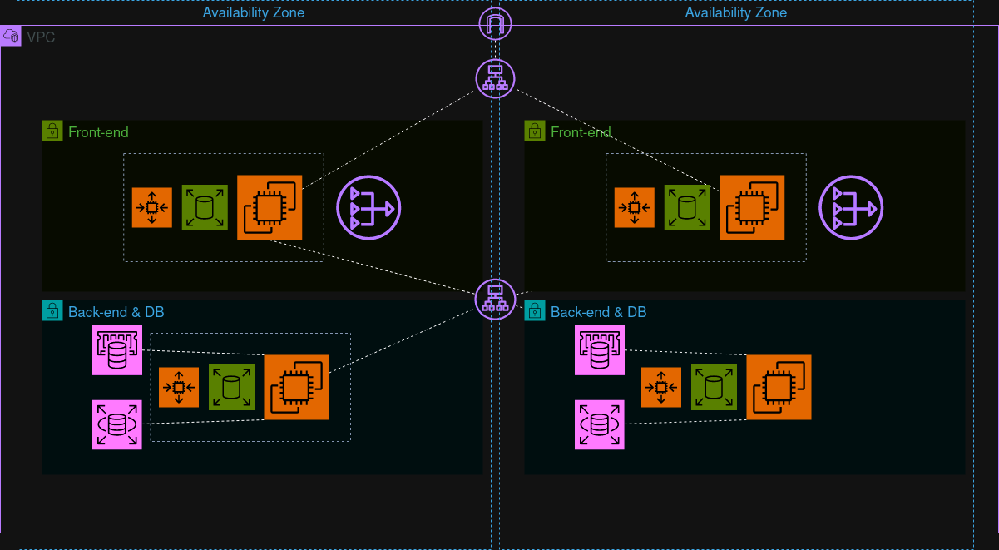

VPC

### Sub-redes

Dentro da VPC, é possível encontrar dois tipos de sub-redes, a pública e a privada:

#### Sub-rede Pública:

É uma sub-rede que pode ser acessada diretamente da internet. Normalmente, o front-end da aplicação se encontra nesse tipo de sub-rede.

  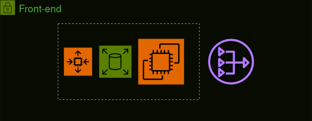

Sub-rede Pública

#### Sub-rede Privada:

Uma sub-rede privada na AWS Cloud é uma segmentação de uma Amazon Virtual Private Cloud (VPC) que não é acessível diretamente pela Internet. Ela é projetada para hospedar recursos de computação que não requerem conexão direta com a Internet, como servidores de banco de dados, aplicações internas, e sistemas de back-end que precisam de segurança adicional. Entretanto, caso queira conectar-se na internet, é possível por meio da utilização de um NAT (Network address translation).

  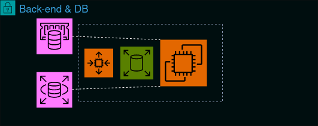

Sub-rede Privada

## Fluxo da Arquitetura

O fluxo da Arquitetura foi divido em etapas, explicando como ocorre a comunicação entre os serviços e o usuário.

### Usuário, Internet e Conexão:

O usuário irá se conectar com a nossa aplicação por meio da Internet, os primeiros serviços utilizados serão o Route 53 que será responsável por converter os IP numéricos que os computadores usam para se conectarem entre si por nomes (como https://www.inteli.edu.br/). Além do Route 53, existe o CloudFront que será responsável por proporcionar uma alta disponibilidade, já que ele possui diversos pontos de presença, disponibilizando o aplicativo em várias partes do mundo, com baixa latência. Sendo assim, o Route 53 e o CloudFront serão responsáveis por contornar problemas como failover.

Periodicamente, o serviço HealthCheck ficará monitorando os recursos da aplicação (Zonas de disponibilidade, etcs). Caso algum recurso não esteja saudável, ocorre uma comunicação entre o HealthCheck e o Route53, o qual fica responsável por rotear o usuário para que ele nao acesse o recurso não saudável, garantindo, assim, uma alta disponibilidade e confiabilidade.

Failover refere-se ao processo automático de mudança para um sistema sem falhas, no caso de falha, erro ou problema de desempenho no sistema principal.

Todo o acesso externo, ou seja, fora do ambiente da AWS Cloud deve passar pela Internet Gateway, o componente que faz essa "ponte" entre o ambiente externo (internet) e o interno (cloud AWS). Ao passar pelo Gateway, o Application Load Balancer irá redirecionar o usuário para a instância mais adequada para o consumo de forma automática, melhorando assim o desempenho da aplicação. 

É importante mencionar que o usuário terá o seu acesso restrito apenas ao front-end, um local o qual ele poderá interagir de forma segura com os dados.

  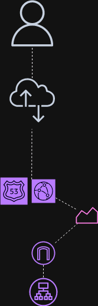

Acessando à internet

### Conexão Front-end e Back-end

Dentro da Sub-rede Pública, temos 4 serviços: 
- Uma instância EC2 que armazena o front-end da aplicação, o qual o usuário vai acessar. 
- Um Auto Scaling EC2 responsável por ajustar automaticamente a quantidade de instâncias EC2 em operação, mantendo assim a performance e a alta disponibilidade. 
- O Bastion Host, representado pelo mesmo símbolo do EC2, responsável por permitir a conexão administrativa externa ao back-end (sub-rede privada). No caso, o usuário não terá contanto com esse serviço diretamente, já que é utilizado somente para fins de manuntenção.
- Um NAT (Network Address Translation) que possibilita que o back-end requisite informações da internet. Ao mesmo tempo, ele que bloqueia conexões externas ao back-end.

A conexão entre o front-end e o back-end também é mediada por um Application Load Balancer, fazendo com que as chamadas de servidor tenham mais desempenho devido ao balanceamento de conexões.

  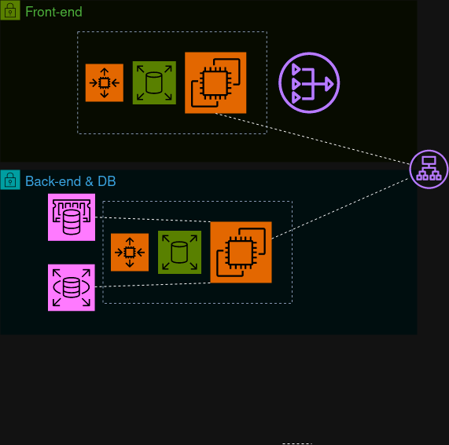

Acessando o front-end

### Back-end e Monitoramento de Logs

Além da sub-rede pública, temos a sub-rede privada, na qual encontra-se o Back-end, banco de dados e uma API Gateway.

O back-end está operando em uma instância EC2 que interage simultaneamente com dois tipos de armazenamento de dados: um banco de dados relacional RDS e um banco de dados em cache utilizando o Elastic Cache. As requisições são processadas de tal forma que ambos os bancos são consultados, e o que responder mais rapidamente fornece os dados necessários ao back-end. Este processo é monitorado e, ao ser executado, gera registros de log. Esses logs são capturados por uma função AWS Lambda, que é responsável por enviá-los ao S3 Glacier. Além disso, temos um Auto Scaling EC2 que será responsável por ajustar automaticamente o número de máquinas EC2, conforme a demanda for aumentando ou diminuindo, tornando a aplicação mais escalável.

Para backup e armazenamento dos logs, será utiizado um Cloudwatch para monitorar o arquivo de log dentro da instância EC2 do frontend, o Lambda para automatizar os processos de backups e transferir os dados(logs), provenientes do CloudWatch, para o Glacier, onde podem ser armazenados por um longo período de tempo.

  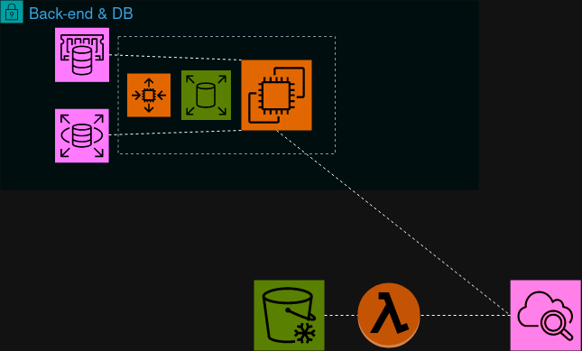

Monitoramento de Logs

### Testes de Carga

O teste de carga é uma prática muito utilizada na computação corporativa. Ela se refere à simulação de usuários virtuais que acessam a aplicação simultaneamente até uma ocasião programada, com por exemplo, a queda dos servidores. Essa prática é essencial para mensurar a Quality of Service (QOS) do sistema implementado, ou seja, conseguir medir a performance de um serviço na execução da tarefa a qual ele foi desenvolvido para realizar.

Para gerenciar os testes de carga, foi empregado o serviço do Grafana Cloud K6. Essa ferramenta executa scripts de teste nas aplicações. Esses scripts determinam as configurações dos testes, como o número de usuários virtuais, a duração dos testes e as métricas analisadas. Após o K6 executá-los, os resultados são homologados para a análise do desempenho.

Na arquitetura em questão, o cliente da suíte de ferramentas do Grafana da AWS será utilizado para testas a arquitetura elaborada. A análise dos resultados trazem um insight sobre se a infraestrutura proposta usa mais ou menos recursos do que o necessário para satisfazer as necessidades do cliente. Isso faz com que a redução dos custos seja possível e ajuda a visualizar o que deve ser aprimorado na solução.

  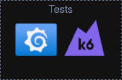

Testes de carga

### Kubernetes

Kubernetes (K8s) é uma ferramenta open-source para a orquestração de containers. Ele possibilita a automatização do deploy da aplicação, assim como garante que a mesma seja escalável. Diante do cenário de projeto atual, esse recurso foi empregado como uma alternativa para o deploy das aplicações. Abaixo, o diagrama ilustra como essa ferramenta foi empregada:

O cliente utilizado de Kubernetes foi o Minikube, que permite que as máquinas mestre e escravos estejam em um mesmo host. A escolha desse cliente se deu primeiramente pela escala do projeto, uma vez que o mesmo é um MVP (Minimum Viable Product) e também devido a similaridade desse cliente com o próprio Kubernetes. Isso implica que todos os manifestos, scripts e comandos podem ser igualmente reproduzidos usando o cliente original do Kubernetes.

  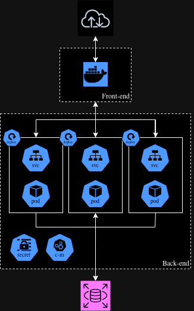

Arquitetura em kubernetes

A seguir cada parte da arquitetura será explicitada, ressaltando a função de cada componente.

#### Entrando na aplicação

Assim como na arquitetura anterior, toda a interação com a aplicação deve ser feita a partir do front-end. Nessa nova arquitetura, o front-end está sendo implementado em forma de container em engine de docker. Apesar da prática mais comum na implementação de front-end ser de usar o K8s, o grupo decidiu que, para o MVP, o docker seria utilizado devido a escala do projeto.

  

Docker

#### Conexão com o cluster

O front-end e o back-end possuem uma interface virtual construída dento do cluster de K8s. Essa interface é representada pelo services (SVC). Cada API possui o seu SVC e ele atua de forma a balancear a carga de requisições que chegam para cada aplicação. Isso torna possível que uma frota de containers de um único microsserviço seja requisitada por meio de um único endereço.

  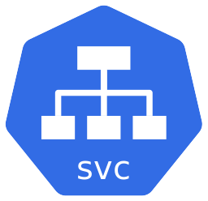

K8s Service

#### Criação de pods

Pods são uma abstração do conceito de containers em K8s. Cada pod possui um ou mais containers (geralmente representando um único microsserviço) e consegue obter recursos de armazenamento e de rede disponibilizado pela configuração construída.

Para criar os pods, o grupo utilizou o recurso de deployment (deploy), que cria uma "receita" de como esse pod deve ser deployed, definindo as suas configurações e o número de replicas que serão implementadas no cluster.

  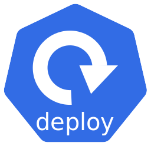
  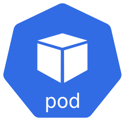

K8s Deployment & Pod

#### Configuração de variáveis

Para acessar variáveis de ambiente importantes para o funcionamento da aplicação (como por exemplo o endereço e senha do banco de dados) os recursos de config-maps (cm) e secrets (secret) foram utilizados. O primeiro possui variáveis que possuem um certo grau de privacidade, mas não comprometem a segurança da aplicação, como o endereço do banco de dados, por exemplo. Já o segundo serve para guardar informações que não podem ser facilmente lidas por terceiros, como nome de usuário do banco de dados e a sua senha. Por default, o secrets aceitam apenas valores codificados em base64, mas também existem plugins que melhoram a segurança do armazenamento desses dados.

Uma grande vantagem de utilizar variáveis de ambiente externas se dá pelo desacoplamento das aplicações, permitindo que a integração seja facilmente controlada, sem precisar recompilar nenhum software.

  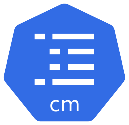
  

K8s Config-map & Secret

#### Automação com template engines

Template engines ajudam na configuração de aplicações parecidas. Para configurar os diversos microsserviços de maneira otimizada, foi utilizado o Helm, um software responsável por gerenciar os pacotes de K8s. O helm possui um template engine built-in que ajuda nessa construção.

  

Helm

  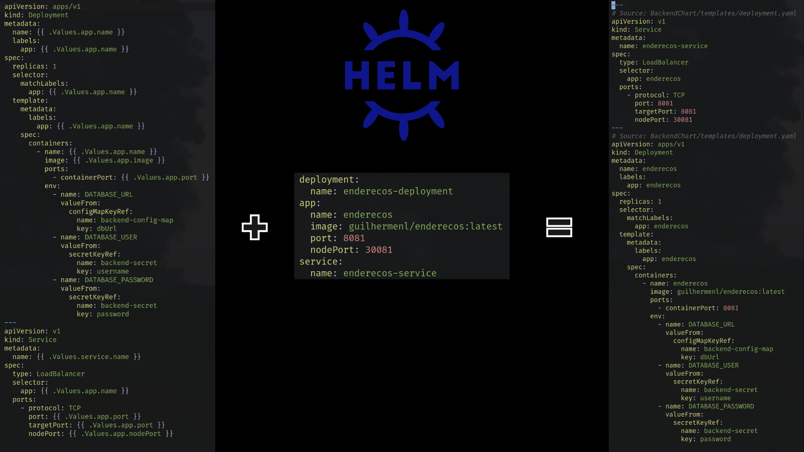

Usando o helm como engine de templates

A imagem da esquerda é o template que serve como base para a construção do manifesto e a do meio indica os valores que o helm deve preencher no template. Já a imagem da direita é o output gerado pelo programa, o manifesto que será utilizado para a criação do recurso no cluster.

### Nova Arquitetura com Kubernetes

  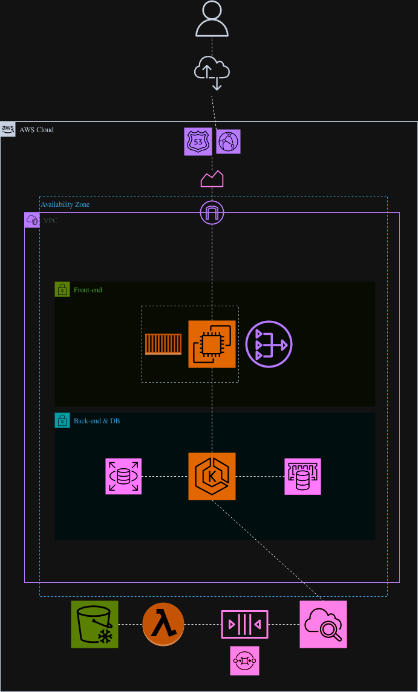

Nova arquitetura

Na nova arquitetura, foram adicionados alguns componentes, sendo eles: Kubernetes e Sistema de filas. O Kubernetes é um orquestrador de contêineres que ajuda a automatizar a implantação, escalonamento e gestão dos contêineres. No caso deste projeto, o Kubernetes foi utilizado para orquestrar e gerenciar os contêineres, executando toda a lógica dos microsserviços, os quais estão conectados ao ElastiCache e ao Amazon RDS.

  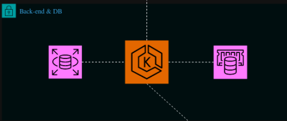

Kubernetes em uma instância EC2

Ainda no backend, não tínhamos acesso ao serviço gerenciado AWS EKS devido às limitações do Learnet Lab da AWS. Diante disso, optou-se pela utilização de uma instância EC2 para gerenciar o Kubernetes e seus contêineres.

Por fim, temos a implementação do sistema de filas, o qual pode ser subdividido em duas partes principais: Amazon SQS e Fila. A fila funciona como um buffer, permitindo que as mensagens sejam mantidas até que o sistema de processamento esteja pronto para tratá-las. Por outro lado, o Amazon SQS é um serviço da AWS responsável pelo gerenciamento dessa fila, auxiliando no tráfego de mensagens de forma confiável.

  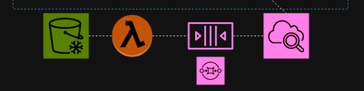

Sistema de fila

### Funcionamento do Barramento

O barramento, dentro de nossa arquitetura, é um elemento vital que atua como um mediador entre o frontend e o todo o backend. Ele funciona como um orquestrador das requisições provenientes do frontend. No momento em que essas requisições são enviadas para o barramento, ele fica responsável por distribui-las entre o Elastic Cache o banco de dados RDS de forma paralela. Aquele que processar a requisição mais rápido será o responsável por retornar a informação para o barramento, que direciona para o frontend e em seguida para o usuário.

Portanto, dentro da aplicação, o barramento possui algumas funções sendo elas:

- **Centralização das requisições**: Todas as requisições passam pelo barramento, que age como um ponto central da aplicação. Essa centralização é importante, pois permite que ele envie as requisições em paralela, ou seja, ao mesmo tempo para o Cache e para o banco de dados relacional.

- **Distribuição eficiente entre o Elastic Cache e RDS**: Com as requsições em um único local, o barramento facilita a distribuição das requisições e o envio simultâneo para o cache e para o banco de dados. Isso não apenas simplifica o processo de distribuição, mas também permite que o sistema aproveite a rapidez oferecida pelo Elastic Cache e a integridade e persistência dos dados oferecido pelo RDS de maneira mais rápida.

