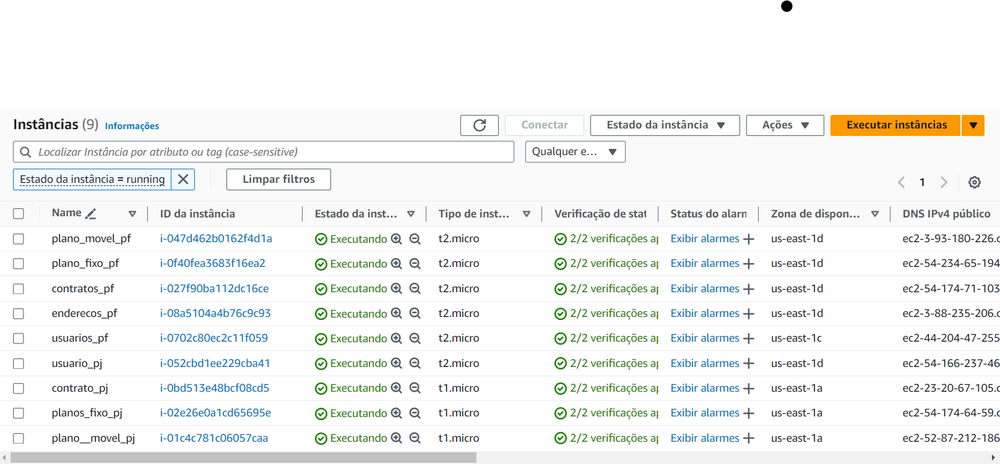
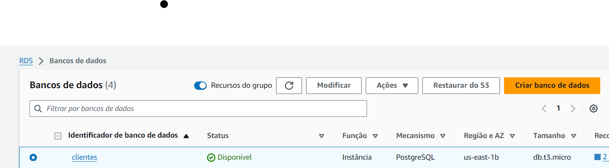

# Back-end

Para a documentação do backend do projeto, estamos utilizando principalmente a ferramenta Postman. Com essa ferramenta, podemos realizar testes de requisições para verificar o funcionamento dos endpoints, além de documentar detalhes importantes, como parâmetros de entrada, tipos de requisição suportados (GET, POST, PUT, DELETE), e os formatos de resposta esperados.

Optamos por adotar uma arquitetura de microsserviços para o projeto, o que resultou na criação de 10 APIs correspondentes às 10 tabelas do banco de dados. Para suportar essa arquitetura, provisionamos uma instância EC2 na Amazon AWS para cada API.

Todas as instâncias EC2 com um microsserviço.

Além disso, também subimos nosso banco de dados(Postgres) em uma instância do RDS(Amazon AWS).

Instância do Banco de Dados RDS

Para exemplificar melhor todas as operações e requisições que podem ser feitas, foi preparado um workspace no Postman, detalhando todas as Requisições(GET, PUT, DELETE e POST) com suas respectivas URLs.

Link:

Por fim, foi realizado um vídeo, demonstrando o acesso à máquina EC2 para utilizar o microsserviços e realizar as requisições para o banco de dados.

Link do vídeo: https://youtu.be/8SQzffK4mXQ

Obs: Caso as requisições não funcionem no Postman com a URL da amazon, é possivel rodar localmente o backend e fazer requisições para o banco de dados.

Link do vídeo para rodar localhost: https://youtu.be/DtD979orQyc

Para demonstrar quais serviços da AWS foram utilizados pelo projeto, foi confeccionado um vídeo demonstrativo:

Link do vídeo dos serviços: https://www.youtube.com/watch?v=jFZrqFtlRtc