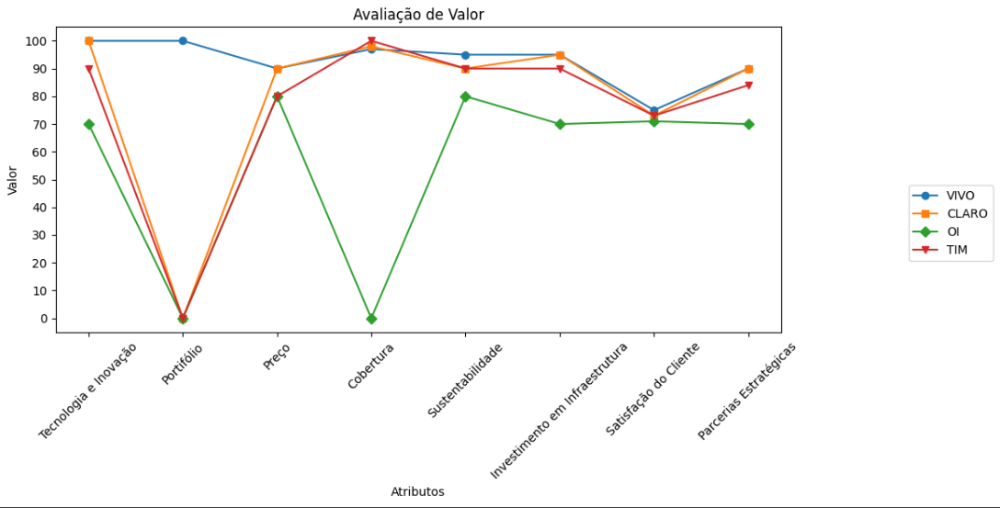
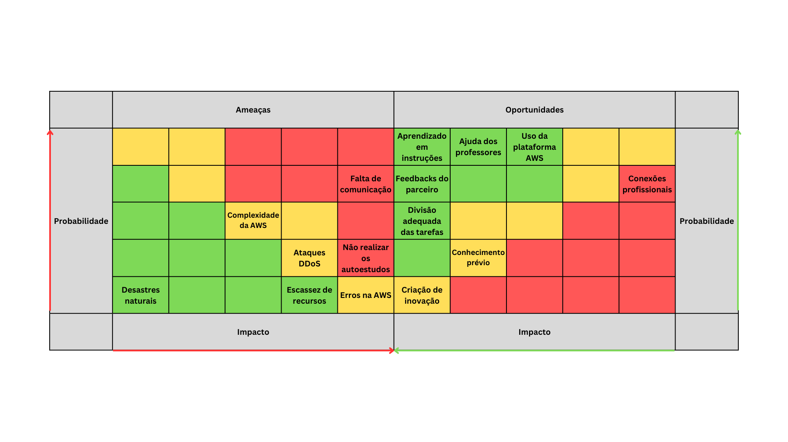
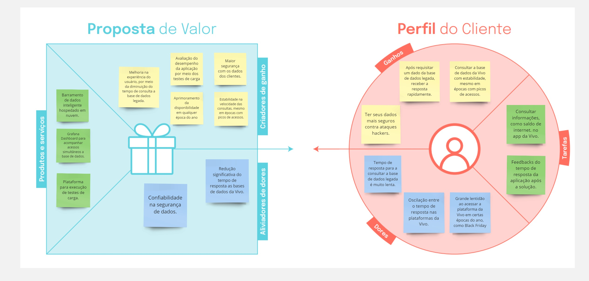
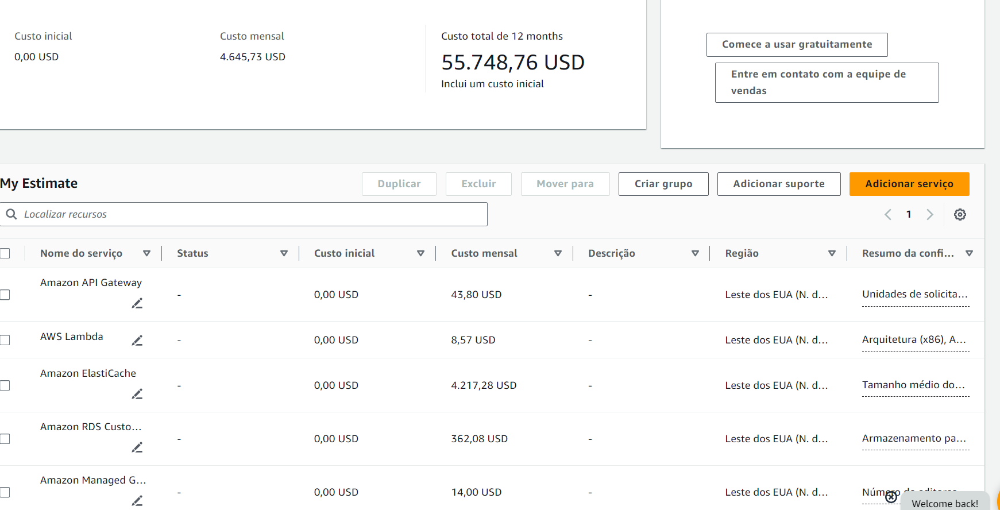

# Entendimento de negócio

Neste artefato, apresentamos uma análise abrangente do negócio, utilizando diversos frameworks, como Oceano Azul, Matriz de Risco, Canvas de Proposta de Valor e Análise Financeira. O objetivo é obter um entendimento mais profundo da empresa com a qual planejamos colaborar. Este documento serve como um recurso para compreender a empresa, suas operações e seu potencial no mercado, fornecendo uma base sólida para futuras decisões e estratégias de negócio.

## Matriz de Oceano Azul

O framework "Oceano Azul" foi desenvolvido por W. Chan Kim e pela Renée Mauborgne em 2005 com a missão de oferecer uma abordagem estratégica inovadora às empresas, incentivando a exploração de novos mercados, em detrimento da concorrência acirrada em mercados saturados. Os criadores, Kim e Mauborgne, propõem que as organizações busquem oportunidades de crescimento em "oceanos azuis", territórios inexplorados e livres de competição. Uma das ferramentas essenciais dentro deste framework é a Matriz de Avaliação de Valor, que auxilia as empresas na identificação e exploração de novos mercados, comparando atributos como qualidade, praticidade, custo-benefício, entre outros.

Além disso, para diferenciar as empresas que utilizam-se do "Oceano Azul", é empregada uma estratégia que se resume nas ações: Reduzir, Eliminar, Aumentar e Criar. Essas ações visam diferenciar as empresas e produtos, permitindo que se destaquem em ambientes de mercado não convencionais e inexplorados.

### Reduzir
Nessa ação, a ideia é reduzir ou simplificar características presentes em produtos ou serviços tradicionais, tendo em vista que a mudança não impacta negativamente o usuário.

### Aumentar
Nessa ação, o foco está em ampliar os atributos que são valorizados pelos clientes, visando proporcionar maior valor e eficiência do que os concorrentes oferecem aos usuários finais.

### Criar
Essa ação envolve a criação de um atributo. Ou seja, seria o diferencial da solução em relação aos demais concorrentes.

### Eliminar
Nessa ação, a estratégia envolve a remoção de atributos que a concorrência pode considerar essenciais, mas que, na realidade, não afetam significativamente o valor percebido pelo cliente.

## Matriz de Avaliação de Valor

Para realizar a avaliação de valor, foram pesquisadas empresas concorrentes que apresentassem semelhanças com a solução proposta.

As empresas analisadas incluem: Vivo (parceira de projeto) e concorrentes como Claro, Oi e TIM:

**Vivo**

A Vivo, fundada em 2003 através de uma joint venture entre Portugal Telecom e Telefónica (Espanha), expandiu significativamente sua atuação no mercado de telecomunicações. A empresa (Vivo), em 2010, foi adquirida 100% pela Telefónica, tornando-se parte do Grupo Telefónica. Atualmente, a empresa está em segundo lugar em número de assinantes de banda larga. Ela oferece diversos serviços relacionados à comunicação, desde telefonia móvel e fixa até televisão por assinatura, serviços de nuvem (B2B), marketplace e serviços de streaming. Além disso, a Vivo atua também na área da saúde e educação por meio de seus aplicativos e projetos paralelos, como Vivo Educa e Vivo Saúde. Vale ressaltar que a Vivo atende mais de 100 milhões de clientes na América Latina.

**Claro**

A Claro é uma das principais empresas de telecomunicações do Brasil. Fundada em 2003 no Brasil, mas pertencente ao grupo mexicano América Móvil. Atualmente, a Claro emprega mais de 100 mil funcionários, disponibilizando uma ampla variedade de serviços de comunicação, incluindo telefonia móvel, fixa, internet e televisão por assinatura para mais de 100 milhões de clientes na America Latina. É importante destacar que a Claro é a operadora com o maior número de assinantes de banda larga em todo o país.

**Oi**

A Oi, anteriormente Telemar, foi fundada em 1998 no Rio de Janeiro. A empresa passou a ser chamada de Oi apenas em 2003, sendo uma das pioneiras em oferecer serviços convergentes de banda larga, TV por assinatura e transmissão de voz local e de longa distância. Atualmente, a companhia é a operadora com maior capilaridade de rede de fibra, totalizando 400 mil quilômetros. Além disso, é a quarta maior em número de assinantes no setor de telecomunicação.

**TIM**

A TIM Brasil é uma empresa do grupo TIM, a maior empresa de telecomunicações da Itália, fundada em 1995, porém iniciou suas operações em 1998. Foi pioneira na tecnologia 3G, sendo a primeira operadora a oferecer esse serviço no Brasil. Além disso, a empresa expandiu sua cobertura de telefonia e internet móvel por todo o Brasil, tornando-se a terceira maior empresa de telefonia no território brasileiro.

Com base nessas empresas e nas informações sobre elas, criou-se atributos relacionados ao setor, para que pudéssemos, de acordo com nossas pesquisas, elencar valores para cada um dos atributos de cada empresa. Dessa forma, criou-se uma tabela, a fim de sumarizar essas informações. Em seguida, construiu-se um gráfico para que seja possível visualizar as diferenças entre os concorrentes em determinados atributos/características.

    
Imagem 01: Tabela da Avaliação de Valor.

    
Fonte: Elaborado pelos autores.

    
Imagem 02: Gráfico da Avaliação de Valor.

    
Fonte: Elaborado pelos autores.

### Atributos

1 - Tecnologia e Inovação.

A capacidade de liderança de uma empresa de telecomunicações em tecnologia e inovação é fundamental para se destacar em um mercado em constante evolução. Investimentos em pesquisa e desenvolvimento, o lançamento de produtos revolucionários e a adoção de novas tecnologias são essenciais para manter a relevância e atrair clientes em busca de soluções ou serviços de ponta.

2 - Portfólio.

Um portfólio diversificado de serviços oferece aos clientes opções adaptadas às suas necessidades individuais, permitindo que a empresa atenda a uma variedade de demandas e preferências. A inclusão de uma ampla gama de serviços, desde pacotes básicos até ofertas exclusivas, pode aumentar a atratividade da empresa e sua capacidade de atender a diferentes segmentos de mercado.

3 - Preço.

A estratégia de preços desempenha um papel crucial na competitividade das empresas de telecomunicações. Uma abordagem de preços agressiva pode atrair clientes em busca de ofertas econômicas, enquanto estratégias de precificação diferenciadas podem capturar segmentos de mercado dispostos a pagar mais por valor agregado. Encontrar o equilíbrio certo entre preço e valor percebido é essencial para o sucesso no mercado.

4 - Cobertura.

A disponibilidade é um dos aspectos fundamentais que impactam diretamente a experiência do cliente. Uma cobertura abrangente e uma rede de alta qualidade garantem conexões estáveis e rápidas, satisfazendo as necessidades dos clientes em termos de comunicação e acesso à internet, independentemente de sua localização.

5 - Sustentabilidade.

O compromisso com práticas sustentáveis e responsabilidade ambiental é cada vez mais valorizado pelos consumidores e pela sociedade como um todo. Empresas de telecomunicações que adotam iniciativas para reduzir seu impacto ambiental, como o uso de energias renováveis e a minimização de resíduos, demonstram seu compromisso com um futuro mais sustentável, ao mesmo tempo em que podem atrair consumidores conscientes.

6 - Investimento em Infraestrutura.

A contínua expansão e modernização da infraestrutura de rede são cruciais para acompanhar a crescente demanda por serviços de telecomunicações. Investimentos em tecnologias emergentes garantem que a empresa esteja preparada para oferecer serviços de alta qualidade, mantendo sua competitividade no mercado.

7 - Satisfação do Cliente. 

A satisfação do cliente é um indicador-chave da qualidade dos serviços oferecidos por uma empresa de telecomunicações. Um alto nível de satisfação reflete a capacidade da empresa de atender às expectativas dos clientes em termos de qualidade da rede, atendimento ao cliente e valor percebido, contribuindo para a fidelidade do cliente e a reputação da marca

8 - Parcerias Estratégica.

Estabelecer parcerias estratégicas com outras empresas e organizações pode ampliar o alcance da empresa e enriquecer seu portfólio de serviços. Colaborações com fabricantes de dispositivos, provedores de conteúdo e outras empresas de tecnologia podem resultar em ofertas inovadoras e soluções integradas que agregam valor aos clientes e diferenciam a empresa no mercado.

### Modelo das quatro ações:

#### **Reduzir**:

- ***Preço***: Para a seleção dos valores atribuidos para a tabela foi levado em consideração o preço dos planos Controles de cada operadora e os beneficios do plano. Foi observado que os valores variavam entre 49R$ a 52R$, entretanto, tanto a Claro, quanto a Vivo ofereciam uma quantidade GB parecida, com beneficios como Ligação e SMS ilimitados para qualquer outra operadora, por isso receberam nota 90. Por outro lado, a TIM e a OI ofereciam uma quantidade maior de GB, mas com beneficios piores como SMS limitados ou ligação ilimitado apenas entre numeros da mesma operadora, por isso receberam a nota 80. Dessa forma, a Vivo teria um espaço para um oferecer um produto com um preço maior que seus concorrentes, já que o valor agregado do seu produto é maior, esse aumento de preço nao iria ocasionar uma grande mudança para o cliente.

#### **Aumentar**:

- ***Parcerias Estratégicas***: Para determinar a nota de cada operadora, foi utilizado como base as parcerias realizadas com empresas externas. No caso da Vivo, ela possui o segmento Vivo Empresas, que funciona como um centro de apoio para startups e empresas pequenas, oferecendo serviços como contabilidade, hospedagem e sistemas de gestão. Além da Vivo Empresas, a Vivo possui parcerias com a Oracle e Endeavor, por isso, recebeu nota 90. Assim como a Vivo, a Claro possui seu segmento direcionado a empresas, no qual oferece serviços gratuitos e com descontos como Alura e Movida, recebendo nota 90. A TIM também possui um plano voltado para empresas com algumas parcerias como Deezer Premium, porém, não chega aos mesmos benefícios oferecidos pela Claro e Vivo, dessa forma, recebeu nota 84. Por fim, a Oi possui poucas parcerias voltadas para beneficiar os clientes empresariais, sendo a principal parceria com a PagSeguro, ofertando uma redução da taxa de transação. Portanto, recebeu nota 70. Em suma, aumentar as parcerias estratégicas é essencial para ampliar os atributos valorizados pelos clientes, permitindo que a empresa ofereça uma gama mais abrangente de serviços e benefícios por meio de colaborações com outras organizações.

- ***Satisfação do Cliente***: O cálculo da Satisfação do Cliente baseou-se na pesquisa realizada pela ANATEL (Agência Nacional de Telecomunicações). Foram entrevistadas 88 mil pessoas, que responderam perguntas relacionadas à qualidade dos serviços prestados, como Internet Fixa, Pós-Paga, Pré-Paga, Telefone Fixa e TV por assinatura, dos principais players do mercado. Dessa forma, na pesquisa, a Oi recebeu 71, a Claro 73, a Vivo 75 e a TIM 73. Em suma, é importante aumentar a satisfação do cliente, haja vista que um cliente satisfeito tende a permanecer fiel à marca, passa a recomendar seu produto ou serviço para outros e, consequentemente, resulta no aumento de receita.

- ***Cobertura***: Para determinar o valor desse atributo, levou-se em consideração a porcentagem (%) da população brasileira dentro da cobertura de rede de cada operadora. No caso da TIM, por abranger 100% de todas as cidades do Brasil com sua tecnologia 4G, foi atribuída a nota 100. A Claro cobre quase 4800 cidades brasileiras, o que corresponde a 98% da população dentro de seu raio de cobertura 4G, enquanto a Vivo segue com mais de 3200 cidades, cerca de 97% de toda a população brasileira. No entanto, no caso da Oi, não foi possível encontrar uma informação concreta de quantas cidades ou porcentagem da população que a cobertura da Oi atinge, por isso foi atribuído o valor 0. Com isso, podemos concluir que ampliar a cobertura de rede para a Vivo é importante para garantir que um número ainda maior de pessoas tenha acesso ao seu serviço, fortalecendo sua posição competitiva dentro do setor de telecomunicações.

- ***Sustentabilidade***: A pontuação do Atributo Sustentabilidade baseou-se nos projetos sociais de cada empresa, reconhecimentos e premiações em projetos que a empresa esta relacionada. Na Vivo, foi possível indentificar em seu site, diversos reconhecimentos relacionados as práticas ESG(Environment, Social and Governance), dentre elas, a Vivo se encontra no Top 5 do índice de Sustentabilidade Empresarial da B3, está presente no índice ESG da MSCI(Mercados Emergentes, América Latina e Global), além de receber o prêmio 'Guardioes do Clima' do Pacto Global da ONU Brasil envolvendo estratêgias para utilizar menos carbono, logo recebeu a nota 95. Já a Claro, recebeu 90, devido aos seus projetos sociais, principalmente, o Instituto Claro, que tem como missão conectar as pessoas para um futuro melhor por meio do investimento em projetos de educação e cidadania, utilizando a tecnologia para desenvolvimento humano, social e ambiental. Para a TIM atribui-se a nota 90 por pertencer ao ***Sustainability YearBook*** elaborada pelo S&P Global e ao ISE(Indice de Sustentabilidade Empresarial) da B3. Além disso, a TIM atua comprometida com melhores práticas ambientais, fazendo parte do Índice de Carbono Eficiente(ICO2). Por fim, a Oi possui reconhecimentos na área da Cultura, Educação e Inovação Social, dentre eles o Prêmio Cultura da Paz 2022, Prêmio Valor Inovação Brasil 2020, onde a empresa estava entre as 100 empresas mais inovadoras do Brasil, com isso, a Oi recebeu o valor 80

- ***Investimento em Infraestrutura***: Para determinar a pontuação de cada empresa, utilizou-se como base as Demonstrações Financeiras do ano de 2022 de cada operadora. Nas Demonstrações Financeiras, foi observado o valor destinado para investimentos. Em 2022, a Claro teve um investimento em torno de 10.0 bilhões de reais, conseguindo uma nota de 95. A Vivo desembolsou 9.5 bilhões de reais, levando uma nota 95. Em terceiro lugar, a TIM realizou investimentos de aproximadamente 5.8 bilhões de reais, resultando na nota 90. Por fim, a Oi investiu cerca de 3.8 bilhões de reais, o que levou à nota 70. No caso da Oi, recebeu uma nota menor, já que grande parte do investimento foi direcionado para o segmento de Fibra, enquanto nas outras operadoras, os investimentos foram divididos entre outras áreas, como Fixa, Móvel, 5G, TV por assinatura, entre outras. O investimento em infraestrutura é fundamental para garantir uma experiência satisfatória ao Cliente, permitindo que os serviços sejam entregues de forma eficiente e confiável, garantindo a disponibilidade, velocidade e qualidade para atender os clientes.

- ***Tecnologia e Inovação***: Para encontrar o valor que cada operadora possui no Atributo Tecnologia e Inovação, levou-se em consideração as Demonstrações Financeiras de cada empresa, precisamente, de como foi feita a distribuição dos investimentos no ano de 2022. Na Claro, os 10 bilhões disponibilizados para investimento foram divididos em aquisição de outras empresas como a rede de ativos móveis da Oi, incorporação da Nextel para a Claro e investimentos voltados para a infraestrutura necessária para possibilitar a tecnologia 5G. Devido a isso, foi atribuída a nota 100. Da mesma forma que a Claro, a Vivo, também, adquiriu uma parte das operações da Oi. Além das operações, a Vivo focou grande parte do seu investimento para reforçar a rede móvel para ativação da tecnologia 5G nas capitais e para expandir a rede de fibra, aumentando sua cobertura no Brasil. O último pedaço das operações de rede móvel da Oi foi comprada pela TIM, que realizou outros investimentos como a compra da empresa Cozani e da I-Systems. Por fim, a Oi recebeu a menor nota devido à venda de grande parte de suas operações para as suas concorrentes. Entretanto, a Oi investiu pesadamente em tecnologia, com o objetivo de inovar o seu principal setor, que é o de fibra óptica. Portanto, devido à baixa diversificação dos segmentos, a Oi recebeu a menor nota.

#### **Criar**:

- ***Portfólio***:
Dentre as concorrentes, a Vivo foi a única que expandiu seu plano de negócio para diferentes áreas, oferecendo serviços para a área de saúde por meio do ValeSaúdeSempre e ATMA, atuando na área da educação por meio do Vivae, na parte de serviços financeiros com o VivoPay, VivoMoney e VivoSeguros. Além disso, possuem um próprio marketplace com o VivoShopping, rede de entretenimento com o VivoPlay, e até serviços no segmento de casa inteligente com o Vivo Casa Inteligente e Vivo Guru. Dito isso, é visível que a Vivo possui um grande ecossistema que tem como objetivo interagir com os clientes em diferentes frentes. Por isso, foi atribuída nota máxima para a Vivo. Já a Claro, TIM e Oi não estabeleceram um ecossistema de mesma magnitude que a Vivo. Elas optaram em fortalecer seus serviços no setor de origem(telecomunicações). Em suma, das 4 operadoras, apenas a Vivo criou seu próprio ecossistema, possibilitando a oferta de diversos serviços de diferentes segmentos para os clientes.

#### **Eliminar**:

- Nenhum atributo foi selecionado para eliminação, considerando que, em um mercado com concorrência acirrada, não seria estratégico para as empresas, especialmente para a Vivo, eliminar algum dos atributos.

## Matriz de riscos

A matriz de risco é uma ferramenta essencial para o gerenciamento de riscos de um projeto. Essa matriz é composta por dois blocos principais: **oportunidades** e **ameaças**. Ambas as partes contêm células que representam acontecimentos que possuem um certo nível de probabilidade de acontecer e um certo nível de impacto causado se eles, de fato, ocorressem. 

As medidas de probabilidade e impacto estão indicadas pelas setas na vertical e na horizontal na ilustração abaixo, respectivamente.

Abaixo, está a ilustração da matriz de risco, bem como a explicação de cada ponto, justificando a sua posição na matriz:

Imagem 03: Matriz de risco

Fonte: Elaborado pelos autores.

***Ameaças***

1. **Desastres naturais:** Embora com baixa probabilidade, eventos naturais podem afetar os servidores na AWS. No entanto, devido à redundância dos dados em zonas de disponibilidade geográfica distinta, o impacto seria minimizado.
   - Plano de Contingência: Garantir backups frequentes e automatizados dos dados. 
2. **Complexidade da AWS:** A vasta gama de serviços e configurações na AWS pode apresentar desafios, mas a abundância de recursos disponíveis facilita o desenvolvimento do projeto, apesar da média probabilidade de ocorrência.
   - Plano de Contingência: manter contato direto, próximo e constante com o professor Goya, especialista em serviços da AWS, para nos auxiliar durante todo o desenvolvimento do projeto.
3. **Ataques DDoS:** Embora improvável devido ao ambiente restrito e divulgação limitada do serviço, ataques DDoS poderiam causar sérios problemas de disponibilidade, dado o requisito funcional de alta disponibilidade da aplicação.
   - Plano de Contingência: Utilizar o AWS Shield para proteção contra DDoS.

4. **Escassez de recursos:** O projeto conta com uma alocação orçamental restrita de 100 dólares por conta AWS, o que pode limitar a utilização de serviços mais avançados ou escalabilidade necessária para o desenvolvimento e operação do projeto.
   - Plano de Contingência: Implementar uma gestão de custos rigorosa, com monitoramento contínuo através do AWS Cost Explorer e alarmes do AWS Budgets para prevenir gastos excessivos.
5. **Erros na AWS:** A constante melhoria da robustez da AWS reduz a probabilidade de erros, mas sua ocorrência comprometeria a integridade da aplicação.
   - Plano de Contingência: Implementar monitoramento e alertas contínuos, através de envio de emails quando a aplicação der erro, para identificar rapidamente problemas. 
6. **Não realizar os autoestudos:** Embora essa prática de autoestudos pelo grupo seja comum em projetos anteriores, a sua carência poderia prejudicar a base teórica necessária para produzir um produto de qualidade, apesar da baixa probabilidade.
   - Plano de Contingência: durante a realização da reunião de alinhamento, verificar a dificuldade de cada um em relação aos autoestudos e se todos estão fazendo.
7. **Falta de comunicação:** Com alta probabilidade, a falta de comunicação eficaz entre colegas, parceiros e professores pode prejudicar a coesão do projeto e o cumprimento dos requisitos orientados.
   - Plano de Contingência: tirar todo o proveito das dailys para que todos possam estar alinhados do andamento e execução de cada tarefa.

***Oportunidades***

1. **Conexões profissionais:** O ambiente universitário oferece amplas oportunidades de conexões profissionais, embora limitadas pelo escopo do grupo definido, reduzindo o impacto dessas interações.
2. **Uso da plataforma AWS:** A utilização da ampla gama de serviços e configurações na AWS proporciona uma oportunidade de aprendizado significativa sobre computação em nuvem, criando uma base sólida para este e futuros projetos.
3. **Conhecimento prévio:** Embora os integrantes do grupo não tenham experiência prévia com a AWS, o conhecimento prévio sobre outras ferramentas pode ser aproveitado para adaptar e expandir suas habilidades no contexto da nuvem.
4. **Ajuda dos professores:** A equipe qualificada de professores da instituição oferece um apoio crucial para enriquecer o conhecimento do grupo e fornecer orientação essencial para a realização do projeto.
5. **Criação de inovação:** Apesar da baixa probabilidade, a criação de novos recursos inovadores poderia gerar um impacto significativo não apenas no projeto, mas também na comunidade de computação em nuvem como um todo.
6. **Divisão adequada das tarefas:** A divisão adequada das tarefas dentro do grupo é fundamental para garantir que todos os membros tenham oportunidades de aprendizado equitativas e evitar sobrecarregar qualquer colaborador individualmente.
7. **Feedbacks do parceiro:** Os feedbacks fornecidos pelo parceiro, com sua equipe qualificada na área de nuvem, são essenciais para a construção do conhecimento e para a personalização eficaz da aplicação, atendendo às necessidades específicas do cliente.
8. **Aprendizado em instruções:** As instruções fornecidas permitem que os membros do grupo adquiram o conhecimento necessário para o desenvolvimento do projeto, ao mesmo tempo em que enriquecem seu aprendizado individual.

## Canvas da Proposta de Valor
O Canvas da Proposta de valor é uma ferramenta visual poderosa que auxilia empresas na definição da proposta de valor que oferecem aos seus clientes com seus produtos ou serviços. Por meio de uma estrutura simples e intuitiva, o Canvas da Proposta de Valor permite mapear os elementos que geram valor para os clientes e como a empresa se diferencia da concorrência com eles. 
Para a construção do Canvas da Proposta de Valor, precisamos entender e preencher os seguintes tópicos:

* Produtos e Serviços: São as ofertas que você entrega para o cliente, podem ser tanto produtos físicos, quanto digitais.

* Criadores de Ganho: os benefícios que seus produtos ou serviços oferecem aos clientes.

* Aliviadores de Dores: Soluções que sua proposta de valor oferece para os problemas, desafios e frustaçoes que os clientes enfrentam.

* Dores: São os problemas, desafios e frustaçoes que os clientes enfrentam no dia a dia.

* Ganhos: Benefícios que os clientes desejam alcançar.

* Tarefas: As atividades que os clientes realizam atualmente para resolver seus problemas e a alcançar seus objetivos.

Pensando nisso, elaboramos um Canvas de Proposta de Valor para analisar como nosso projeto agregará valor aos clientes da Vivo. Esse instrumento nos permitirá identificar precisamente as necessidades dos clientes e demonstrar como nossa solução as atenderá eficazmente.

    
Imagem 04: Canvas da Proposta de Valor.

    
Fonte: elaborado pelos autores.

## Análise Financeira do Projeto

Por motivos de objetivo de aprendizagem do módulo e relativização de salário, na análise financeira não será incluso custos relacionados à pessoas para desenvolver e manter a solução, ou seja, a análise financeira dos custos terá foco nos custos dos serviços da AWS que serão utilizados para a solução final.

### Aprofundamento na solução idealizada
Ao analisar os custos do projeto, primeiro precisamos esclarecer totalmente nossos objetivos de entrega e, assim, definir quais serviços e configurações serão necessárias para a entrega e manutenção do projeto.

A solução final do projeto será divididas em 2 principais entregas:

- Um barramento de dados (um sistema de integração que permite a comunicação entre diferentes sistemas, facilitando a troca de dados e a orquestração de processos entre sistemas de TI), que será um funil com 3 etapas: consulta em cache, consulta no banco de dados com informações essenciais em nuvem, e consulta inteligente nos bancos de dados legados.
  - A primeira etapa utilizará Amazon ElastiCache para armazenar e recuperar rapidamente os dados esperados pelas requisições do aplicativo da Vivo. Caso o dado necessário não esteja em cache, a requisição passará para a segunda etapa.
  - Na segunda etapa, será feita uma consulta no Amazon RDS (Relational Database Service), que conterá dados essenciais para o aplicativo da Vivo e será atualizado a cada mudança no banco de dados original. Caso o dado necessário pela requisição não se encontre no nosso banco de dados em nuvem, a requisição passará para a terceira etapa.
  - Na terceira e última etapa do barramento de dados, caso os dados requisitados não tenham sido obtidos em nenhuma etapa anterior, será feita uma consulta inteligente nos bancos de dados legados da Vivo. Essa consulta inteligente é basicamente uma condensação de várias requisições com o mesmo objetivo, onde serão agrupadas em consultas únicas, a fim de não sobrecarregar os bancos de dados legados. Quando a resposta dos bancos legados for obtida, os dados serão decompostos separadamente por cada requisição feita no barramento de dados.
- Monitoramento contínuo do barramento de dados:
  - Através do Amazon CloudWatch e AWS Grafana, conseguiremos ter acesso, em tempo real, à situação, em termos de infraestrutura, do barramento de dados. Entre as informações essenciais que serão obtidas, temos: capacidade total da nossa aplicação e a taxa de utilização dela. Nesse sentido, será feita uma automação para quando a taxa de utilização estiver próxima do limite médio estabelecido inicialmente, os responsáveis pelo sistema serão alertados por meio de envio de emails.

Somado a isso, será desenvolvida uma aplicação que simulará os dados únicos de cada cliente, para conseguirmos mensurar nosso barramento de dados através de uma aplicação visual. Por fim, para testar o limite da nossa aplicação, serão realizados diversos testes de carga, a fim de entender o limite médio que nosso barramento de dados suportará, sem que precise escalar exponencialmente o uso de recursos.

Dessa forma, resumidamente, utilizaremos 8 principais serviços pagos da AWS: 
- **AWS Lambda** e **Amazon API Gateway** para o funcionamento do barramento de dados, permitindo a execução de código em resposta a eventos e a gestão de APIs.
- **Amazon ElastiCache** para armazenar e recuperar rapidamente os dados mais requisitados.
- **Amazon RDS (Relational Database Service)** para servir como nosso banco de dados com informações essenciais em nuvem.
- **Amazon Grafana** para termos acesso em tempo real à situação da aplicação.
- **AWS Load Testing Service** para realizar testes de carga e garantir a escalabilidade da aplicação.
- **Amazon CloudFront** e **Amazon EC2** para o simulador, com o CloudFront distribuindo o front-end e o EC2 hospedando o back-end.

### Projeção de custos
Com a solução idealizada esclarecida e os serviços da AWS a serem utilizados identificados, no início de cada tópico iremos definir um valor médio de requisições/capacidade para podermos calcular a projeção dos custos do projeto.

#### AWS Lambda e Amazon API Gateway
O cálculo do custo destes serviços utiliza como base o número de requisições HTTP. De acordo com o WorkShop com o parceiro, o aplicativo da Vivo recebe, em média, 1000 visitas por minuto.

Dessa forma, temos que a Vivo, por dia, recebe em média 1.440.000 requisições (1000 por minuto x 60 minutos x 24 horas). De acordo com essas configurações, o custo anual do Amazon API Gateway será de cerca de 525 dólares. Já o AWS Lambda terá um custo de 103 dólares anuais.

#### Amazon ElastiCache
Para esse cálculo, foi entendido que o tamanho médio dos dados de cache será de 40GB, tendo, em média, 31 solicitações por segundo (1000 solicitações por minuto/60 segundos). Dessa forma, o custo anual para manter esse serviço será 50607 dólares.

#### Amazon RDS (Relational Database Service)
Para o Amazon RDS, foi optado o serviço 'Amazon RDS for SQL Server', pois tem maior compatibilidade com bancos de dados legados. A configuração do serviço é 32GB de RAM para um melhor desempenho, ficando ativo 8h por dia (distribuídos em horários de pico), com 2TB de armazenamento total. Com isso, o custo para manter essas configurações é de 4345 dólares anuais.

#### Amazon Grafana
Com um editor/administrador por espaço de trabalho mensal, o custo anual será de 168 dólares.

#### AWS Load Testing Service
Esse serviço não está na calculadora da AWS. No entanto, é possível calcular o preço médio que seria através do número de requisições. Para a cada 1000 requisições, é cobrado `$`1.25 (dólar), ou seja, assumindo um valor de 60 mil acessos por minuto, durante 10 minutos, temos 600 mil acessos. Dividindo por 1000 (número de requisições para cada `$`1.25) e depois multiplicando por `$`1.25, temos que um teste de carga envolvendo 60000 requisições por minuto durante 10 minutos custaria 750 dólares por teste de carga.

#### Amazon CloudFront e Amazon EC2
Estes serviços servirão apenas para simularmos o app da Vivo, então o custo será apenas no desenvolvimento do projeto. Considerando um valor básico de transferência de 100GB de dados de saída para a internet, o serviço de CloudFront cobraria apenas `$`11.13. Já o EC2, considerando manter um carga horária de 8h por dia para ele ficar ativo, com 8GiB de memória e 4 vCPUs, utilizaremos a instância c6g.xlarge, onde custaria apenas `$`33.09 para desenvolver o projeto.

Ao analisar todos os custos necessários para para desenvolver e manter o projeto, será necessário cerca de `$`55.748,76 (dólares) por ano para manter todas as aplicações funcionais. Além disso, para o desenvolvimento com base nos simuladores será necessário `$`44.22 (dólares, pagamento único). Por fim, para cada teste de carga será necessário desembolsar `$`750 (dólares).

    
Imagem 05: Custos dos serviços da AWS para o projeto 

    
Fonte: elaborado pelos autores.

Para uma análise mais detalhada das configurações e custos, foi gerado uma planilha contendo o valor total necessário para manter esses serviços citados: <a href="https://docs.google.com/spreadsheets/d/1ZdQ50bnSDT5VKfFxeO1ixc_BFRWkozUydEr3PeCsEuA/edit?usp=sharing"> clique aqui. </a>

### Projeção de receita

Ao avaliar o impacto financeiro do projeto com a Vivo, é essencial considerar não apenas os custos diretos, mas também o retorno indireto sobre o investimento. Em vez de focar em receitas tradicionais, como a aquisição de novos produtos, optamos por concentrar a análise na retenção de clientes. Este foco é particularmente relevante em mercados de telecomunicações, onde a satisfação do cliente está intrinsecamente ligada à sua lealdade e à probabilidade de permanecer com o serviço.

Com uma base de clientes de 100 milhões no Brasil, a Vivo opera em grande escala, o que amplifica o impacto de qualquer melhoria no serviço. Considerando um ticket médio mensal de R$50 por cliente, a receita por cliente ao longo de três anos é de R$1.800.

Supondo que a insatisfação com a lentidão do aplicativo leve a uma perda de dez clientes em cada milhão, isso representa 1000 clientes potencialmente perdidos ao longo de três anos, equivalendo a uma perda de receita de R$1.800.000. Portanto, em média a Vivo reteria R$600.000 por ano desses clientes que migrariam para outra empresa. Dessa forma, o investimento de cerca de U$55.000 (cerca de R$275 mil) anuais em infraestrutura na AWS é justificado pela retenção desses clientes.

Assim, podemos projetar uma economia – ou receita indireta – de R$325.000 por ano.

Embora esta análise seja hipotética, ela destaca como melhorias incrementais na experiência do usuário podem gerar economia substancial para uma empresa do tamanho da Vivo, com sua vasta base de clientes.

## Referências:

Anatel. Agência Nacional de Telecomunicações. Anatel publica resultados da pesquisa de satisfação e qualidade percebida 2022. Disponível em: https://www.gov.br/anatel/pt-br/consumidor/destaques/anatel-publica-resultados-da-pesquisa-de-satisfacao-e-qualidade-percebida-2022. Acesso em: 7 de fevereiro de 2024.

Claro. Controle. Disponível em: https://www.claro.com.br/celular/controle. Acesso em: 7 de fevereiro de 2024.

Vivo. Planos Controle para Celular. Disponível em: https://www.vivo.com.br/para-voce/produtos-e-servicos/para-o-celular. Acesso em: 7 de fevereiro de 2024.

TIM. Planos Controle. Disponível em: https://www.tim.com.br/rj/para-voce/planos/controle#42c5. Acesso em: 7 de fevereiro de 2024.

Oi. Planos Controle para Celular. Disponível em: https://seo.oi.com.br/celular/controle/. Acesso em: 7 de fevereiro de 2024.

Claro. Sustentabilidade. Disponível em: https://www.claro.com.br/institucional/sustentabilidade. Acesso em: 7 de fevereiro de 2024.

Oi. Sustentabilidade. Disponível em: https://ri.oi.com.br/sustentabilidade-new/. Acesso em: 7 de fevereiro de 2024.

Vivo. Sustentabilidade. Disponível em: https://www.vivo.com.br/a-vivo/sustentabilidade. Acesso em: 7 de fevereiro de 2024.

Oi. Quem somos. Disponível em: https://ri.oi.com.br/sobre-a-oi/quem-somos/. Acesso em: 7 de fevereiro de 2024.

Vivo. Nossa História. Disponível em: https://www.vivo.com.br/a-vivo/a-empresa/nossa-historia. Acesso em: 7 de fevereiro de 2024.

Teletime. Confira as líderes em clientes de banda larga no primeiro semestre. Disponível em: https://teletime.com.br/31/07/2023/confira-as-lideres-em-clientes-de-banda-larga-no-primeiro-semestre/. Acesso em: 7 de fevereiro de 2024.

Vivo. Por que Vivo? Qualidade. Cobertura. Disponível em: https://www.vivo.com.br/para-voce/por-que-vivo/qualidade/cobertura. Acesso em: 8 de fevereiro de 2024.

Claro. Mapa de Cobertura. Disponível em: https://www.claro.com.br/mapa-de-cobertura. Acesso em: 8 de fevereiro de 2024.

Tecnoblog. TIM é a primeira operadora a levar 4G para todas as cidades do Brasil. Disponível em: https://tecnoblog.net/noticias/2023/12/08/tim-e-a-primeira-operadora-a-levar-4g-para-todas-as-cidades-do-brasil. Acesso em: 8 de fevereiro de 2024.

Telefônica Brasil. Vivo recebe prêmio inédito do Pacto Global da ONU Brasil durante COP-28. Disponível em: https://www.telefonica.com.br/noticias/2023/dezembro/vivo-recebe-premio-pacto-global-onu-brasil-cop-28. Acesso em: 8 de fevereiro de 2024.

Vivo. Pegada de Carbono. Disponível em: https://www.vivo.com.br/a-vivo/sustentabilidade/pegada-carbono. Acesso em: 8 de fevereiro de 2024.

Vivo Sustentável. Disponível em: https://vivosustentavel.com.br/. Acesso em: 8 de fevereiro de 2024.

Instituto Claro. Quem Somos. Disponível em: https://www.institutoclaro.org.br/quem-somos/. Acesso em: 8 de fevereiro de 2024.

TIM. TIM figura em lista das empresas mais sustentáveis do mundo. Disponível em: https://www.tim.com.br/sp/sobre-a-tim/sala-de-imprensa/press-releases/institucional/tim-figura-em-lista-das-empresas-mais-sustentaveis-do-mundo. Acesso em: 8 de fevereiro de 2024.
