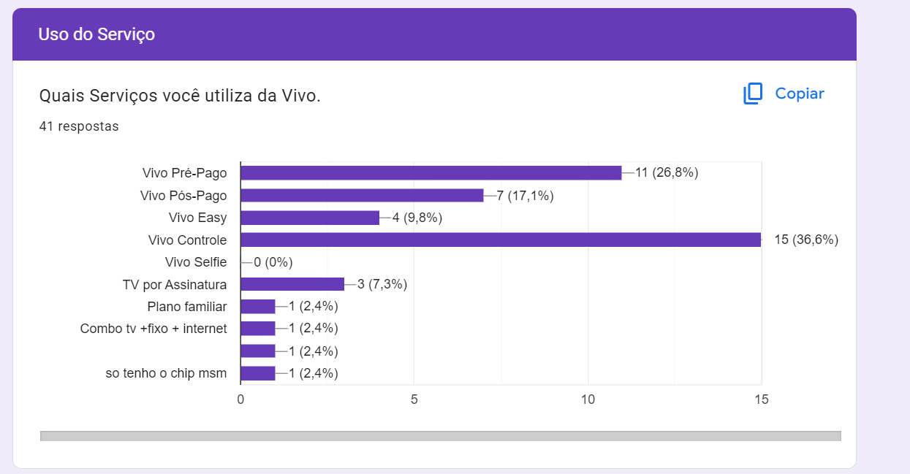
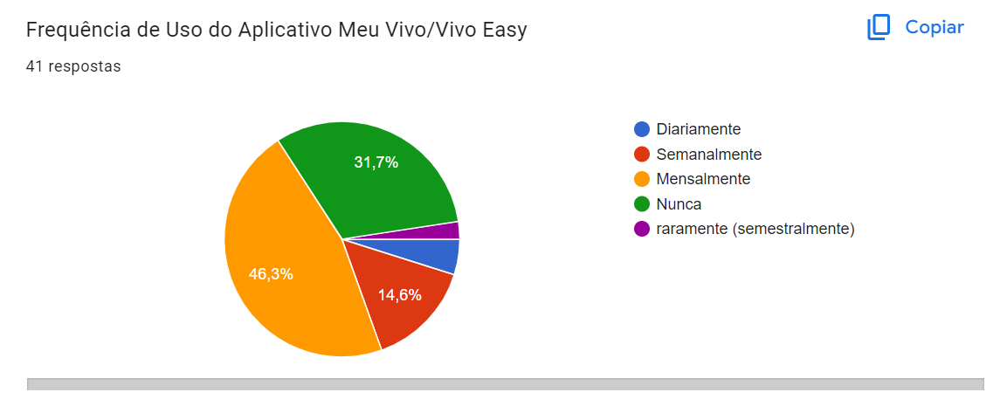
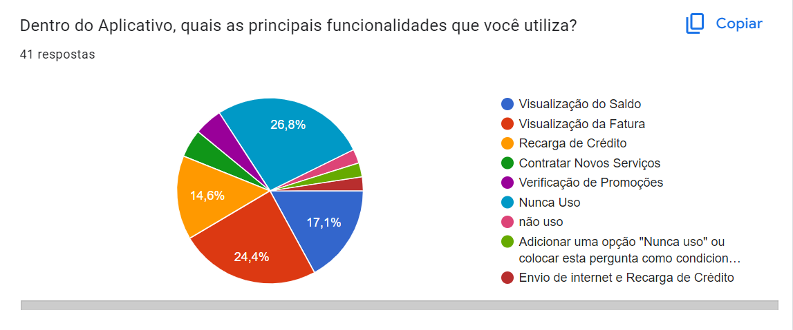
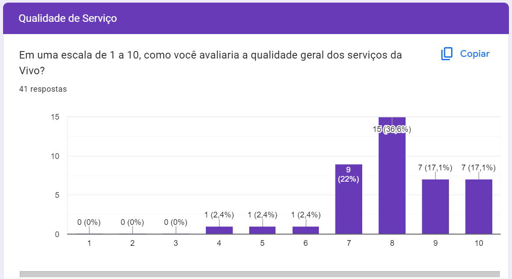
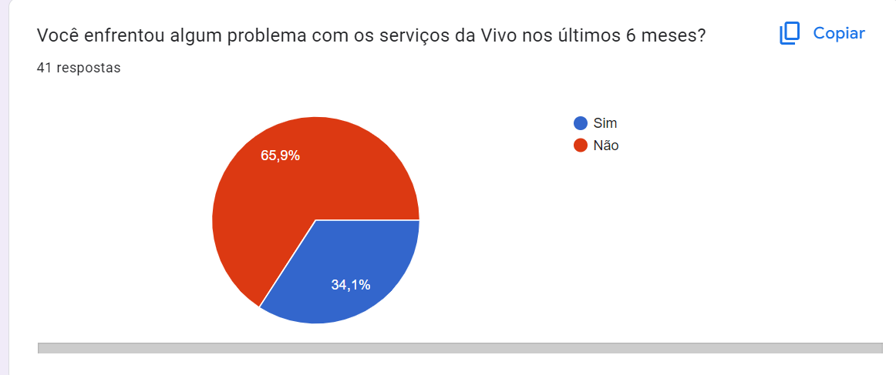

# Entendimento do Usuário

## Imersão Preliminar

Anteriormente à confecção do Minimum Viable Product (MVP), o grupo se reuniu com o parceiro em um kick-off para verificar o entendimento do projeto indicado no (Technical Assistance for Project Implementation) TAPI divulgado em data anterior. Depois de uma apresentação de possíveis soluções e uma rodada de perguntas e respostas, o escopo do projeto pode ser esclarecido.

O estímulo do projeto se deu por um problema enfrentado pelo cliente: a lentidão no recebimento das informações disponíveis em sua base de dados legada (com duração de cerca de 30 segundos, em média), implicava negativamente na experiência dos seus usuários, o que, consequentemente, gerava um atrito na relação do cliente com os mesmos. 

Para solucionar essa problemática, o grupo deve utilizar os recursos de nuvem da Amazon Web Services (AWS) para criar uma aplicação distribuída escalável. Essa aplicação deve envolver um barramento de dados para reduzir esse tempo de consulta às bases de dados para, no máximo, 3 segundos, em média. Isso contribuirá na melhora da experiência do usuário e irá, consequentemente, melhorar o desempenho do parceiro.

A situação do cliente deve ser analisada para a criação dessa aplicação personalizada. A operadora possui um acesso de, em média, 4 à 5 mil acessos simultâneos em seu aplicativo (plataforma a qual a solução do grupo seria, posteriormente, implementada) e a imensa quantidade de requisições proveniente disso é o principal motivo para a lentidão. Além disso, a sua base de dados está distribuída em vários bancos de dados, o que também agrava na velocidade das requisições.

Nessa interação, algumas sugestões foram apontadas. A primeira delas foi o uso de cache, uma espécie de estratégia que armazena dados de uso frequente de forma isolada, facilitando assim, o seu acesso. Outra estratégia discutida foi a organização das múltiplas consultas em requisições inteligentes, ou seja, condensar instruções ao banco de dados de forma a contemplar diversos clientes de uma só vez.

Alguns pontos de atenção também foram levantados para o MVP. Um dos apontamentos foi a impossibilidade de propôr uma solução que modifique a infraestrutura da empresa, uma vez que isso pode causar impactos desastrosos nas operações da mesma. Outro ponto foi para se atentar ao uso do cache de forma adequada. Ainda que essa estratégia consiga minimizar o tempo de resposta do servidor, ele também pode, se usado de forma incorreta, ocasionar na incoerência de dados, resultado no acesso a dados desatualizados ou incorretos. 

Concluindo, a reunião de kick-off com o parceiro foi crucial para esclarecer o escopo do projeto e os pontos de atenção levantados serão levados em consideração para que o produto final seja não só eficaz, como também viável para a implementação segura. 

## Análise da Pesquisa Qualiquantitativa Vivo

### Objetivo
Com essa pesquisa nossa missão foi mergulhar no universo dos clientes Vivo para entender seus desejos, necessidades e comportamentos. Por meio da pesquisa, teremos um guia para a criação de um projeto inovador que atenderá as necessidades dos clientes da Vivo e de grande sucesso, alinhado com as expectativas e anseios do público-alvo.

### Justificativa
A Vivo é uma empresa líder em telecomunicações, com um compromisso inabalável com a excelência. Para manter essa posição de destaque, é crucial compreender profundamente seus clientes, suas motivações e os fatores que influenciam suas decisões.

### Análise Quantitativa

#### Uso de Serviços da Vivo

**Introdução:**

O gráfico apresentado ilustra a distribuição percentual dos serviços da Vivo utilizados por 41 clientes. A análise quantitativa detalhada revelará insights valiosos sobre a base de clientes e suas preferências em relação aos serviços da Vivo.

**Análise por Serviço:**

- **Vivo Controle:** 36,6% dos clientes preferem o Vivo Controle, um plano pós-pago com franquia de dados e minutos, destacando-se como a opção mais popular.
- **Vivo Pré-Pago:** 26,8% dos clientes utilizam o serviço pré-pago, representando uma parcela significativa da base de clientes.
- **Vivo Pós-Pago:** 17,1% dos clientes optam pelo plano pós-pago, evidenciando a demanda por serviços com maior controle de gastos.
- **Vivo Easy:** 9,8% dos clientes utilizam o Vivo Easy, um plano pré-pago com controle de gastos, demonstrando a atratividade de opções intermediárias.

- **Outros Serviços:**
  - **TV por Assinatura:** 7,3% dos clientes assinam TV por assinatura da Vivo, indicando uma demanda por serviços convergentes.
  - **Plano Familiar:** 2,4% dos clientes possuem um plano familiar.
  - **Combo TV + Fixo + Internet:** 2,4% dos clientes aderiram ao combo de serviços.
  - **Apenas Chip:** 2,4% dos clientes possuem apenas o chip da Vivo.

**Observações Relevantes:**

- A distribuição dos serviços indica uma diversificação nas necessidades e preferências da base de clientes.
- O Vivo Controle se destaca como a opção mais popular, evidenciando a busca por planos com controle de gastos e franquia.
- A presença de serviços como TV por assinatura, plano familiar e combo demonstra a demanda por soluções convergentes.

#### Frequência de Uso de Serviços da Vivo

Este relatório apresenta uma análise quantitativa do uso do aplicativo Meu Vivo/Vivo Easy. A análise é baseada em uma pesquisa realizada com 41 respondentes. O gráfico de pizza ilustra a frequência de uso do aplicativo, dividida em cinco categorias: diariamente, semanalmente, mensalmente, nunca e raramente (semestralmente).

##### Análise por Frequência:

- Uso Diário: 46,3% dos usuários utilizam o aplicativo Meu Vivo/Vivo Easy diariamente, indicando um alto nível de engajamento com o aplicativo.
- Uso Semanal: 31,7% dos usuários utilizam o aplicativo semanalmente, sugerindo que eles podem usar o aplicativo para tarefas regulares ou rotineiras.
- Uso Mensal: 14,6% dos usuários utilizam o aplicativo mensalmente, o que pode indicar um uso mais casual ou específico do aplicativo.
- Nunca ou Raramente (Semestralmente): 7,4% dos usuários nunca ou raramente (semestralmente) usam o aplicativo. Isso sugere que uma pequena porcentagem de usuários pode não encontrar valor no aplicativo ou pode ter alternativas preferidas.

##### Observações Relevantes:

- A alta porcentagem de usuários diários e semanais sugere que o aplicativo Meu Vivo/Vivo Easy é uma parte integral da rotina digital de muitos usuários.
- A presença de usuários mensais e aqueles que nunca ou raramente usam o aplicativo indica que há espaço para aumentar o engajamento do usuário através de melhorias no aplicativo ou estratégias de marketing direcionadas.
- A análise da frequência de uso pode fornecer insights valiosos para a Vivo, ajudando a empresa a entender melhor o comportamento do usuário e a otimizar seus serviços e ofertas de acordo.

#### Principais Funcionalidades Utilizadas na Vivo

Este relatório apresenta uma análise quantitativa das principais funcionalidades utilizadas pelos clientes Vivo. A análise é baseada em uma pesquisa realizada com 41 respondentes. O gráfico de pizza ilustra as principais funcionalidades, dividida em oito categorias: visualização de saldo, visualização da fatura, recarga de crédito, contratar novos serviços, verificação de promoçoes, nunca uso, não uso, Envio de internet e recarga de crédito.

##### Análise por Funcionalidade:

- Visualização do Saldo (26,8%): Esta funcionalidade, que envolve a verificação do saldo, é a mais utilizada entre os respondentes.
- Envio de Internet e Recarga de Crédito (24,4%): O envio de internet e a recarga de crédito é outra funcionalidade altamente utilizada, indicando sua importância para os usuários.
Visualização da Fatura (17,1%): A visualização da fatura tem um uso significativo, mas é menor em comparação com a verificação do saldo e a recarga de crédito.
- Recarga de Crédito (14,8%): A recarga de crédito também tem uma porcentagem notável de usuários que dependem dela.
- Outras funcionalidades, como contratação de novos serviços e verificação de promoções, são representadas em fatias menores do gráfico de pizza.

##### Observações Relevantes:

- O gráfico revela que recursos financeiros, como verificação de saldos e faturas, além da recarga de crédito, são fundamentais para os usuários. Há uma gama diversificada de funcionalidades sendo utilizadas, mas com preferências claras voltadas para a gestão financeira dentro do aplicativo.

#### Avaliação da Qualidade dos Serviços da Vivo

O gráfico apresentado é um gráfico de barras que representa os resultados de uma pesquisa sobre a qualidade dos serviços da Vivo. Os participantes foram solicitados a avaliar a qualidade do serviço em uma escala de 1 a 10.

Análise por Avaliação:

- Notas Baixas (1-6): É notável que as notas mais baixas, de 1 a 6, receberam pouquíssimas ou nenhuma resposta. Isso indica que a maioria dos respondentes está relativamente satisfeita com os serviços.
- Nota 7: A nota 7 foi dada por uma boa proporção dos respondentes (22%), indicando que muitos clientes consideram o serviço bom mas não excelente.
- Nota 8: A maioria dos respondentes (36,6%) avaliou o serviço como sendo nota 8.
Notas Altas (9-10): As notas mais altas, 9 e 10, foram atribuídas por uma parcela considerável dos participantes (17,1% cada), mostrando um nível significativo de satisfação.

##### Observações Relevantes

O gráfico sugere que muitos clientes estão satisfeitos com os serviços da Vivo, visto que as notas mais baixas têm pouca representação. No entanto, há espaço para melhorias significativas para alcançar um nível mais alto de satisfação do cliente. Ainda assim, é importante para a Vivo também entender por que alguns clientes deram notas altas e usar essas informações para melhorar ainda mais seus serviços.

#### Problemas Enfretados Serviços da Vivo nos Últimos 6 Meses.

O gráfico apresentado é um gráfico de pizza que ilustra as respostas a uma pergunta de pesquisa sobre as experiências dos clientes com os serviços da Vivo nos últimos seis meses. A pergunta questiona se o respondente encontrou algum problema com os serviços da Vivo nesse período.

##### Observações Relevantes

Uma maioria significativa, 65,9%, dos respondentes indicou que enfrentou problemas com os serviços (“Sim”). Isso sugere que pode haver problemas prevalentes que precisam ser abordados para melhorar a satisfação do cliente e a qualidade do serviço.
Por outro lado, 34,1% relataram não encontrar nenhum problema (“Não”). Isso indica que uma parte considerável dos usuários está satisfeita com os serviços da Vivo.

### Análise Qualitativa

#### Problemas Enfrentados com Serviços da Vivo
A primeira pergunta da pesquisa visou compreender os problemas enfrentados pelos usuários dos serviços da Vivo. As respostas revelaram desafios em diversas áreas, desde dificuldades técnicas como interrupção de internet e lentidão na recarga, até problemas operacionais como cancelamento de plano e atendimento ao cliente.

**Análise Detalhada:**
- Problemas Técnicos: Um ponto recorrente foi a intermitência ou ausência do serviço de internet, afetando atividades diárias como o uso de aplicativos de transporte ou bancários. Isso indica uma oportunidade de melhoria na estabilidade e na confiabilidade dos serviços de dados móveis.
- Atendimento ao Cliente: A necessidade de suporte presencial para resolver problemas que não puderam ser solucionados pelo aplicativo sugere uma oportunidade para aprimorar a funcionalidade e a eficiência do atendimento digital.
- Operações de Sistema: Relatos de problemas com a recarga de créditos e transferência de titularidade destacam a necessidade de otimizar processos operacionais e garantir a transparência e eficácia nas operações de rotina.

**Sugestões para Ação:**
- Melhorar a Infraestrutura de Rede: Investimentos em infraestrutura para aumentar a cobertura e a qualidade do sinal, especialmente em áreas onde foi relatada a inconsistência do serviço.
- Aprimorar o Atendimento Digital: Desenvolvimento de um sistema de atendimento ao cliente mais robusto e intuitivo no aplicativo, para reduzir a necessidade de suporte presencial e melhorar a experiência do usuário.

#### Sugestões para Melhoria dos Serviços
A segunda pergunta buscou coletar sugestões dos usuários para a melhoria dos serviços da Vivo. As respostas variaram desde pedidos por transparência nos planos e ajustes de preços até melhorias na experiência do usuário (UX) e no atendimento ao cliente.

**Análise Detalhada:**
- Transparência e Flexibilidade: Os usuários desejam maior clareza nos valores dos planos e facilidade para mudanças de planos, indicando a necessidade de maior transparência e flexibilidade nas opções de serviço.
- Custo-Benefício: Sugestões de ajustes de preço refletem a sensibilidade dos usuários ao custo dos serviços, pedindo uma melhor adequação dos preços às necessidades do consumidor.
- Experiência do Usuário: Várias respostas apontam para uma deficiência na experiência do usuário no site e no aplicativo da Vivo, sugerindo uma oportunidade para revisão e melhorias no design e funcionalidade dessas plataformas digitais.

**Sugestões para Ação:**
- Foco na Experiência do Usuário: Realizar uma auditoria de UX no aplicativo e no site da Vivo para identificar pontos de fricção e melhorar a jornada do usuário, com ênfase em funcionalidades de autosserviço e atendimento.