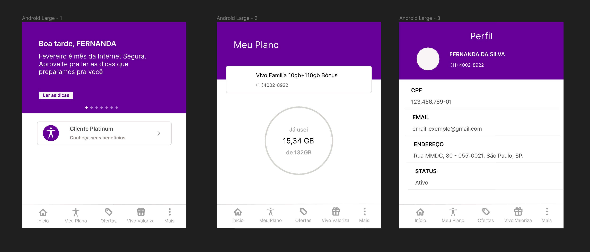

# Front-end

## Protótipo inicial no Figma
O front-end inicial é composto por 3 telas simples inspirados no aplicativo da Vivo, mantendo apenas os componentes com dados específicos dos usuários.

Antes de implementar o front-end, foi elaborado um figma para prototipar as funcionalidades essenciais para a entrega inicial.

    
Imagem 01: protótipo no figma.

    
Fonte: elaborado pelos autores.

Para melhor visualização, é possível acessar o protótipo através do link no figma: <a href="https://www.figma.com/file/relx9SZmeGVOEv2WAcBMuC/vivo-app?type=design&node-id=0%3A1&mode=design&t=GK6KH9Tv5RDt5tZ2-1">clique aqui</a>.

## Protótipo na S3
Dado a elaboração do figma, foi possível componentizar e implementar em React as telas prototipadas, cujo está hospedado no serviço S3 da AWS, onde é possível acessar através do link: <a href="http://vivo-app-front.s3-website-us-east-1.amazonaws.com/">clique aqui.</a>

## Vídeo do front-end
Para explicar melhor sobre as telas, foi gravado um vídeo rápido de 2 minutos, onde é possível acessar através do link: <a href="https://drive.google.com/file/d/1uqiWi7mcBlVnpX-bKYeXhlwcqwQPurWe/view?usp=sharing">clique aqui.</a>

## Atualizações front-end
Na Sprint 2, realizamos atualizações no nosso front-end. Implementamos funcionalidades essenciais, como login, cadastro, visualização de planos e perfil. Além disso, hospedamos o front-end em uma instância EC2. Também gravamos um vídeo de demonstração que abrange todas essas funcionalidades. Você pode acessá-lo aqui.1 <a href="https://drive.google.com/drive/folders/1G9VVdZUe1eyQ7FJ7vK3-LuXq8SjtQz-r?usp=sharing">clique aqui.</a>