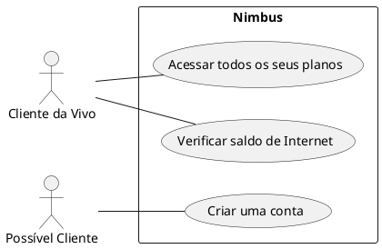
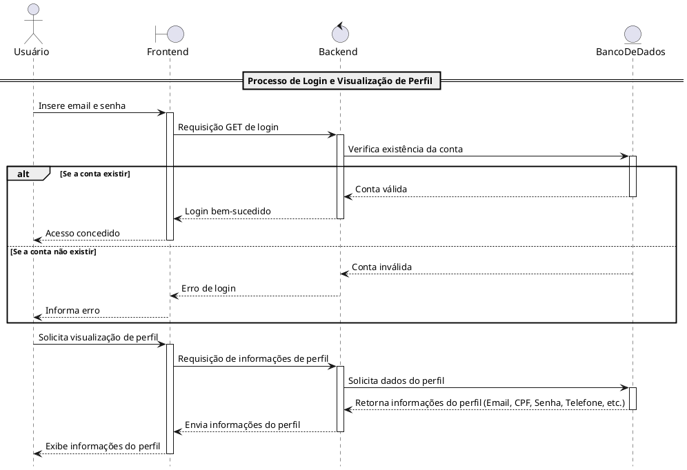
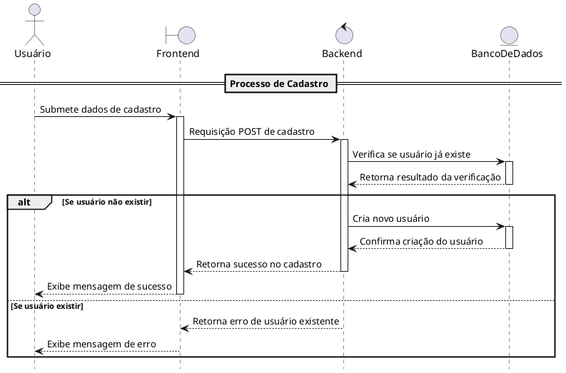
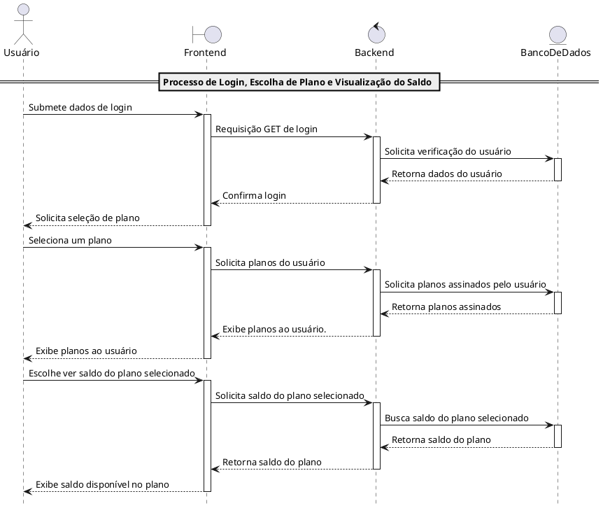
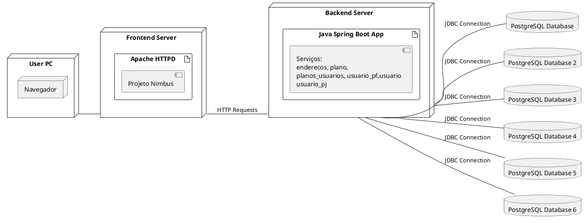

# Modelagem

## Diagrama de Caso de uso.

Utilizando como base a aplicação desenvolvida, foi pensado em 3 casos de usos principais.

**1** - O Cliente poderá acessar o website com o objetivo de conseguir acessar todos os planos assinados por ele.

**Escopo**: Aplicativo da Vivo.

**Nível**: Nível de usuário.

**Atores**: Clientes da Vivo

**Interessados e Interesses**:
 - Cliente: Quer visualizar todos os planos da sua conta.
 - Vivo: Deseja fornecer as informações da conta dos Clientes de forma satisfatória com o objetivo de trazer uma experiencia melhor para os usuários.

**Pré-Condições**:
 - Os clientes/usuários devem estar logados dentro do aplicativo para visualizar os planos.

**Pós-condição**:
 - O sistema deve exibir todos os planos atuais dos clientes/usuários.

**Fluxo Básico**
 - Primeiro, o Cliente faz login na plataforma e acessa a seção "Meu Plano".
 - Em seguida, o aplicativo retorna todos os planos assinados pelo cliente.
  
**Fluxo alternativo**

 - Caso o cliente nao tenha nenhum plano assinado no momento, irá aparecer uma mensagem de feedback alertando que não possui planos assinados.

**Lista de variantess**: Não possui.

**Requisitos especiais**: Nenhum.

**Frequência de ocorrência**: Pouco frequente, 2 vezes ao mês.

**Problemas em aberto**: Determinar a interface do usuário(Desktop ou mobile) para exibir de maneira mais responsiva e otimizada depedendo do dispositivo usado pelo usuário.

--- 
**2** - O Cliente pode verificar a quantidade de GB(Internet) tem no saldo disponível.

**Escopo**: Aplicativo da Vivo.

**Nível**: Nível de usuário.

**Atores**: Clientes da Vivo

**Interessados e Interesses**: 
  - Cliente/Usuário: Quer visualizar quanto de saldo de internet tem disponível.
  - Vivo: Mostrar a quantidade de GB restantes que os cliente possuem.
  
**Pré-Condições**:

- Os clientes/usuários devem estar logados dentro do aplicativo para visualizar o saldo.

**Pós-condição**:
 - O sistema deve exibir o saldo dos clientes.

**Fluxo Básico**:
- 1: O usuário deve acessar o site e inserir suas informações para logar.
- 2: O usuário precisa acessar algum plano que esteja assinado.
- 3: O sistema irá exibir as informações referente ao saldo do Cliente.

**Fluxo Alternativo**:
- Em um caso em que o sistema não consiga mostrar a informação do saldo, deve aparecer uma mensagem de feedback informando o erro ao usuário.

**Requisito especial**: O sistema deve retornar o saldo em tempo real, para uma melhor experiência do usuário.

**Lista de variantes**: Não possui.

**Frequência de ocorrência**: Múltiplas vezes por semana, conforme a necessidade do cliente de checar o saldo disponível.

**Problemas em aberto**: Mostrar o saldo do cliente em tempo real.

---

3 - Um possível Cliente pode se cadastrar no aplicativo para conseguir, no futuro, assinar um plano.

**Escopo**: Aplicativo da Vivo.

**Nível**: Nível de usuário.

**Atores**: Possível cliente.

**Interessados e Interesse**:
- Possível Cliente: Deseja criar uma conta para assinar algum plano de internet.
- Vivo: Interessada em aumentar o número de clientes.

**Pré-Condições**:
- Não possuir uma conta no aplicativo.
  
**Pós-Condição**:
- Possível cliente ter uma conta no aplicativo.

**Fluxo básico**:
  1 - Possível cliente acessar o site.
  2 - Acessar a página "Criar Conta".
  3 - O Sistema solicita informações necessárias para criação da conta.
  4 - Possível Cliente insere as informações requeridas.
  5 - Sistema coleta essas informações e cria a conta do usuário.
  6 - O cliente consegue acessar o aplicativo com a conta registrada.

**Fluxo Alternativo**:
- Caso o cliente tente utilizar um email que já foi cadastrado, irá retornar uma mensagem de erro para o usuário.

**Requisito especial**: O sistema deve validar as informações que o usuário inserir. Por exemplo: se o email já foi cadastrado ou não.

**Lista de Variantes**: Possibilitar o cadastro/login utilizando outros aplicativos(google/redes sociais).

**Frequência de uso**: Frequência baixa, será utilizado apenas quando novos clientes forem criar suas contas no aplicativo.

**Problemas em aberto**: Implementar uma codificação para proteger as informações dos clientes.

## Diagrama de Classe.

Para a criação do Diagrama de Classe levou-se em consideração todos os serviços desenvolvidos para o aplicativo.

Sendo eles:

- enderecos
- plano
- planos_usuarios
- usuario
- usuario_pf
- usuario_pj

Foi descrito no diagrama, todos os componentes dos serviços e o tipo de cada componente.

A tabela usuario_pf representa um usuário pessoa física, que contém os atributos 'cpf', 'rg', 'nome', 'senha', 'data_nascimento', 'id_usuario'. A relação entre o usuario_pf e o usuário é de 1:1. 

A tabela usuario é a classe central para todos os usuários e possui os atributos 'id_usuario', 'tipo', 'nome', 'email', 'data_cadastro', 'saldo'.

Usuario_pj representa um usuário pessoa jurídica e tem os atributos 'cnpj', 'razao_social', 'senha', 'data_nascimento', 'id_usuario'. A relação entre o usuario_pj e o usuário é de 1:1.

Tabela endereco esta associado ao um único usuario e seus atributos são 'id_endereco', 'id_usuario', 'rua', 'cep', 'numero', 'bairro', 'cidade', 'estado'. O id_usuario conecta o endereço a um usuário específico.

A Tabela dos planos descreve os planos oferecidos, com os atributos 'id_plano', 'nome', 'qtd_internet', 'valor'. um usuário pode ter mais de um plano.

A tabela planos_usuarios associa planos a usuarios e seus parâmetros são 'contrato', 'id_plano', 'qtd_internet_consumido', 'qtd_internet_restante', 'data_inicio', 'data_final', 'fatura', 'status', 'id_endereco', 'id_usuario', 'telefone'.

## Diagrama de Sequência.

Este diagrama de sequência demonstra o processo de login e da visualização das informações da conta logada.

Primeiramente, o usuário irá acessar o aplicativo (frontend), onde ele poderá inserir suas informações, como e-mail e senha, para acessar o restante do site. Após o login, será feita uma requisição para o backend, o qual irá validar as informações no banco de dados para identificar se a conta existe ou não. Caso exista, ele adentra o site; caso não, informa um erro ao usuário. Por fim, dentro do site, o usuário poderá visualizar todas as informações referentes à sua conta, como e-mail, CPF, senha, telefone, etc.

No segundo diagrama foi representado o processo de cadastro.

No primeiro momento, o Usuário irá acessar o site e escolher a opção de cadastrar-se. Nesta seção ele irá inserir suas principais informações e irá fazer uma requisição POST para armazenar essas informações no banco de dados, caso a conta já exista, irá retornar para um usuário uma mensagem dizendo "Conta já existente, caso nao exista, o cadastro será efetivado.

O último diagrama representa o processo de visualização dos planos e do saldo disponível.

O Usuário irá submeter os dados de login, o sistema irá fazer uma requisição verificando esses dados. Em seguida, após confirmar o login, o usuário poderá escolher um plano, o sistema irá retornar o plano. Por último, o Usuário irá escolher visualizar o saldo do plano escolhido, que será retornado pelo aplicativo até o usuário, terminando a sequência.

## Diagrama de Implantação

Nossa aplicação pode ser dividida em 3 partes principais: Frontend, Backend e Banco de dados.

O fluxo começa quando o usuário acessa a aplicação por meio de um navegador (Browser). Nesse cenário, o frontend da aplicação opera a partir de um servidor Apache, o qual, por sua vez, faz requisições ao backend através de requisições HTTP. Ademais, o backend foi desenvolvido utilizando o framework Spring Boot do Java, e abriga 6 serviços essenciais: Endereços, Plano, PlanosUsuarios, UsuarioPF, UsuarioPJ e Usuário. Todos esses serviços têm a capacidade de se conectar com os bancos de dados, que foi construído utilizando PostgreSQL.

