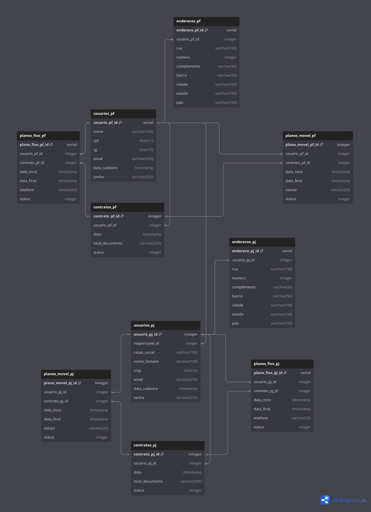

# MVP com deploy da aplicação com arquitetura básica

## Implementação do banco de dados RDS

Para o funcionamento da aplicação, foi necessário implementar um banco de dados relacional para simular as bases de dados do cliente.

Para o banco de dados, foi acordado que o sistema de armazenamento seria o PostgreSQL, um sistema open source para bancos de dados relacionais que permite o armazenamento de dados de forma escalável e configurável. Além disso, a construção do produto em cima do ecossistema da AWS motivou o grupo a gerenciar a base de dados usando o Amazon Relational Database Service (RDS). Essa ferramenta torna a base de dados em uma base gerenciada, ou seja, o scaling, a tolerância a falhas e a disponibilidade são incorporados ao serviço pela AWS. O uso dessa ferramenta também facilita a configuração, backup e implementação do banco de dados.

### Schema do banco de dados

O schema de um banco de dados é a forma de representá-lo logicamente de forma que todas as suas entidades e a forma como elas se relacionam seja explicitada. A imagem abaixo ilustra o schema:



Essa representação foi criada usando a plataforma dbdiagram.io utilizando o Database Markup Language (DBML). Abaixo, está o código .dbml para recriar o mesmo schema:

```
Table usuarios_pf {
  usuario_pf_id serial [primary key]
  nome varchar(100)
  cpf char(11)
  rg char(10)
  email varchar(255)
  data_cadastro timestamp
  senha varchar(255)
}

Table enderecos_pf {
  endereco_pf_id serial [primary key]
  usuario_pf_id integer [ref: > usuarios_pf.usuario_pf_id]
  rua varchar(100)
  numero integer
  complemento varchar(20)
  bairro varchar(50)
  cidade varchar(100)
  estado varchar(100)
  pais varchar(100)
}

Table planos_fixo_pf {
  plano_fixo_pf_id serial [primary key]
  usuario_pf_id integer [ref: > usuarios_pf.usuario_pf_id]
  contrato_pf_id integer [ref: > contratos_pf.contrato_pf_id]
  data_incio timestamp
  data_final timestamp
  telefone varchar(20)
  status integer
}

Table planos_movel_pf {
  plano_movel_pf_id serial [primary key]
  usuario_pf_id integer [ref: > usuarios_pf.usuario_pf_id]
  contrato_pf_id integer [ref: > contratos_pf.contrato_pf_id]
  data_incio timestamp
  data_final timestamp
  celular varchar(20)
  status integer
}

Table contratos_pf {
  contrato_pf_id serial [primary key]
  usuario_pf_id integer [ref: > usuarios_pf.usuario_pf_id]
  data timestamp
  local_documento varchar(255)
  status integer
}

Table usuarios_pj {
  usuario_pj_id serial [primary key]
  responsavel_id integer [ref: > usuarios_pf.usuario_pf_id]
  razao_social varchar(100)
  nome_fantasia varchar(100)
  cnpj char(18)
  email varchar(255)
  data_cadastro timestamp
  senha varchar(255)
}

Table enderecos_pj {
  endereco_pj_id serial [primary key]
  usuario_pj_id integer [ref: > usuarios_pj.usuario_pj_id]
  rua varchar(100)
  numero integer
  complemento varchar(20)
  bairro varchar(50)
  cidade varchar(100)
  estado varchar(100)
  pais varchar(100)
}

Table planos_fixo_pj {
  plano_fixo_pj_id serial [primary key]
  usuario_pj_id integer [ref: > usuarios_pj.usuario_pj_id]
  contrato_pj_id integer [ref: > contratos_pj.contrato_pj_id]
  data_incio timestamp
  data_final timestamp
  telefone varchar(20)
  status integer
}

Table planos_movel_pj {
  plano_movel_pj_id serial [primary key]
  usuario_pj_id integer [ref: > usuarios_pj.usuario_pj_id]
  contrato_pj_id integer [ref: > contratos_pj.contrato_pj_id]
  data_incio timestamp
  data_final timestamp
  celular varchar(20)
  status integer
}

Table contratos_pj {
  contrato_pj_id serial [primary key]
  usuario_pj_id integer [ref: > usuarios_pj.usuario_pj_id]
  data timestamp
  local_documento varchar(255)
  status integer
}
```

Um apontamento notável é a separação das tabelas entre os clientes do tipo pessoa física e os do tipo pessoa jurídica. Isso é uma boa prática de segurança para evitar a mistura de dados, manter a privacidade e facilitar as consultas.

Para então, finalmente, gerar o banco de dados na AWS. A seguinte query em formato .sql foi executada no banco de dados remoto: 

```sql
CREATE TABLE usuarios_pf (
  usuario_pf_id SERIAL PRIMARY KEY,
  nome VARCHAR(100),
  cpf CHAR(11),
  rg CHAR(10),
  email VARCHAR(255),
  data_cadastro TIMESTAMP,
  senha VARCHAR(255)
);

CREATE TABLE enderecos_pf (
  endereco_pf_id SERIAL PRIMARY KEY,
  usuario_pf_id INTEGER,
  rua VARCHAR(100),
  numero INTEGER,
  complemento VARCHAR(20),
  bairro VARCHAR(50),
  cidade VARCHAR(100),
  estado VARCHAR(100),
  pais VARCHAR(100),
  FOREIGN KEY (usuario_pf_id) REFERENCES usuarios_pf(usuario_pf_id)
);

CREATE TABLE contratos_pf (
  contrato_pf_id SERIAL PRIMARY KEY,
  usuario_pf_id INTEGER,
  data TIMESTAMP,
  local_documento VARCHAR(255),
  status INTEGER,
  FOREIGN KEY (usuario_pf_id) REFERENCES usuarios_pf(usuario_pf_id)
);

CREATE TABLE planos_fixo_pf (
  plano_fixo_pf_id SERIAL PRIMARY KEY,
  usuario_pf_id INTEGER,
  contrato_pf_id INTEGER,
  data_inicio TIMESTAMP,
  data_final TIMESTAMP,
  telefone VARCHAR(20),
  status INTEGER,
  FOREIGN KEY (usuario_pf_id) REFERENCES usuarios_pf(usuario_pf_id),
  FOREIGN KEY (contrato_pf_id) REFERENCES contratos_pf(contrato_pf_id)
);

CREATE TABLE planos_movel_pf (
  plano_movel_pf_id SERIAL PRIMARY KEY,
  usuario_pf_id INTEGER,
  contrato_pf_id INTEGER,
  data_inicio TIMESTAMP,
  data_final TIMESTAMP,
  celular VARCHAR(20),
  status INTEGER,
  FOREIGN KEY (usuario_pf_id) REFERENCES usuarios_pf(usuario_pf_id),
  FOREIGN KEY (contrato_pf_id) REFERENCES contratos_pf(contrato_pf_id)
);

CREATE TABLE usuarios_pj (
  usuario_pj_id SERIAL PRIMARY KEY,
  responsavel_id INTEGER,
  razao_social VARCHAR(100),
  nome_fantasia VARCHAR(100),
  cnpj CHAR(18),
  email VARCHAR(255),
  data_cadastro TIMESTAMP,
  senha VARCHAR(255),
  FOREIGN KEY (responsavel_id) REFERENCES usuarios_pf(usuario_pf_id)
);

CREATE TABLE enderecos_pj (
  endereco_pj_id SERIAL PRIMARY KEY,
  usuario_pj_id INTEGER,
  rua VARCHAR(100),
  numero INTEGER,
  complemento VARCHAR(20),
  bairro VARCHAR(50),
  cidade VARCHAR(100),
  estado VARCHAR(100),
  pais VARCHAR(100),
  FOREIGN KEY (usuario_pj_id) REFERENCES usuarios_pj(usuario_pj_id)
);

CREATE TABLE contratos_pj (
  contrato_pj_id SERIAL PRIMARY KEY,
  usuario_pj_id INTEGER,
  data TIMESTAMP,
  local_documento VARCHAR(255),
  status INTEGER,
  FOREIGN KEY (usuario_pj_id) REFERENCES usuarios_pj(usuario_pj_id)
);

CREATE TABLE planos_fixo_pj (
  plano_fixo_pj_id SERIAL PRIMARY KEY,
  usuario_pj_id INTEGER,
  contrato_pj_id INTEGER,
  data_inicio TIMESTAMP,
  data_final TIMESTAMP,
  telefone VARCHAR(20),
  status INTEGER,
  FOREIGN KEY (usuario_pj_id) REFERENCES usuarios_pj(usuario_pj_id),
  FOREIGN KEY (contrato_pj_id) REFERENCES contratos_pj(contrato_pj_id)
);

CREATE TABLE planos_movel_pj (
  plano_movel_pj_id SERIAL PRIMARY KEY,
  usuario_pj_id INTEGER,
  contrato_pj_id INTEGER,
  data_inicio TIMESTAMP,
  data_final TIMESTAMP,
  celular VARCHAR(20),
  status INTEGER,
  FOREIGN KEY (usuario_pj_id) REFERENCES usuarios_pj(usuario_pj_id),
  FOREIGN KEY (contrato_pj_id) REFERENCES contratos_pj(contrato_pj_id)
);
```
