# Relatório Técnico

O relatório técnico é um documento que descreve todos os aspectos técnicos e processuais do projeto, levando, em consideração os requisitos não funcionais e os respectivos casos de teste. Portanto, esse relatório tem como objetivo registrar como os componentes do sistema foram testados, quais resultados foram obtidos e como eles se alinham com os objetivos do projeto. Dessa forma, a finalidade do relatório técnico é fornecer visão clara e completa do projeto para todas as pessoas envolvidas, incluindo desenvolvedores, stakeholders e etc.

Para documentar o relatório técnico utilizou-se dos casos de teste e de ferramentas como CloudWatch da AWS, Grafana e K6.

## Requisitos Não Funcionais

Para relembrar quais foram os requisitos não funcionais utilizados nos casos de teste:

**RNF1**: Disponibilidade - Disponibilidade garantida de 99,9% para o barramento de dados.

**RNF2**: Desempenho - Tempo de resposta para consultas de dados não deve exceder 2 segundos.

**RNF3:** Capacidade de Concorrência - A aplicação deve suportar a visualização simultânea por até 30 usuários.

**RNF4:** Compatibilidade de Navegador - A interface deve ser compatível com as versões mais recentes dos principais navegadores.


**RNF5:** Compatibilidade de SO - O simulador deve ser capaz de operar em diferentes sistemas operacionais, incluindo Windows e Linux.


**RNF6:** Usabilidade - A usabilidade do simulador deve ser validada para garantir uma experiência do usuário acessível e satisfatória.

## Casos de Teste

Para assegurar a adequação e eficácia dos requisitos não funcionais do sistema, foram meticulosamente elaborados e executados casos de teste específicos. Estes testes tiveram como principal objetivo validar a capacidade da aplicação de atender a esses requisitos sob diversas condições, incluindo cenários de estresse, como aumento significativo no número de clientes acessando simultaneamente a plataforma, e outras situações adversas e impactantes para o desempenho e a estabilidade do sistema. Ao simular estes ambientes desafiadores, os casos de teste permitiram não apenas a verificação da conformidade com os requisitos não funcionais determinados, mas também forneceram informações valiosas sobre o comportamento da aplicação nessas situações, destacando áreas de robustez e identificando oportunidades de otimização e melhoria.

Dessa forma, cada caso de teste está relacionado á um requisito não ### funcional.

**Caso de teste - RNF1: Disponibilidade.**

Para o teste de disponibilidade, ativou-se o laboratório de testes na AWS, programado para operar por um período de 4 horas(devido as limitações do laborátorio). Durante este intervalo, procedeu-se com a execução de pings direcionados à aplicação (frontend) em intervalos regulares de 5 minutos.

Print do Início do teste:
<div style="text-align:center">
    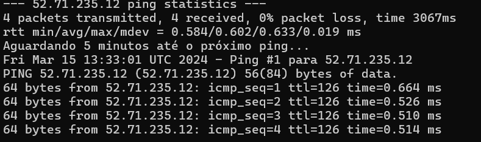
    <p>Início do Teste de Disponibilidade</p>
</div>

Print do Final do Teste:

<div style="text-align:center">
    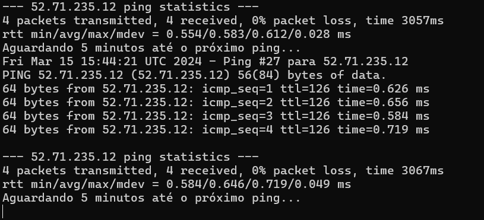
    <p>Final do Teste de Disponibilidade</p>
</div>

Script utilizado para realizar o teste:


```                                                    #!/bin/sh

# Define o IP ou hostname para ping
TARGET_IP="52.71.235.12"

# Define o caminho do arquivo de log
LOG_FILE="PingResults.txt"

# Define o número de vezes para executar o loop (4 horas / 5 minutos = 48 vezes)
TIMES=48

# Loop para pingar o IP específico a cada 5 minutos
for i in $(seq 1 $TIMES)
do
    echo "$(date) - Ping #$i para $TARGET_IP" >> $LOG_FILE
    ping -c 4 $TARGET_IP >> $LOG_FILE
    echo "Aguardando 5 minutos até o próximo ping..." >> $LOG_FILE
    sleep 300 # Aguarda 5 minutos
done

echo "Script concluído."
```

Dessa forma, a gente conseguiu verificar que a aplicação ficou disponível das 13:44 até 15:33, horário em que o laboratório fechou devido as limitações.

### **Caso de teste - RNF2: Desempenho.**

Para executar os testes de desempenho, utilizou-se a ferramenta k6, onde 100 usuários virtuais faziam requisições para os endpoints do back-end e para o front-end. Cada teste teve a duração de 1 minuto.

A máquina que produzia esses testes se encontrava na infraestrutura da AWS, logo, os resultados do acesso através da casa do cliente podem ser levemente distintos do que foi apresentado abaixo.

Os valores de cada coluna indicam o 95° percentil de cada teste. Todos os testes verdes são aqueles que concluiram com sucesso, já os testes amarelos são aqueles que foram abortados pelo testador (para a modificação de configurações do teste, por exemplo). Abaixo, estão os resultados dos testes de tempo de resposta quando a mesma foi "HTTP OK".

<div style="align:center;text-align:center">
    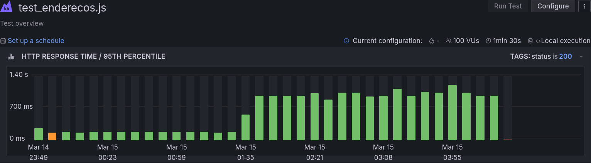
    <p>Teste de desempenho - Enpoint /enderecos</p>
</div>

O teste acima indica os tempos de resposta para acessar o endpoint /enderecos. Até as 1:30 do dia 15 de março, os valores se mantiveram constantes entre 100-270ms, aumentando para valores entre 560-1200ms após esse horário. Esse aumento significativo também foi apresentado nos demais testes em uma janela de horário semelhante. Como os testes foram executados exclusivamente na infraestrutura da AWS, é possível inferir uma hipótese sobre o motivo para esse aumento: A banda larga de internet dentro da rede pode ter sido reduzida para economia e preservação dos recursos.

<div style="align:center;text-align:center">
    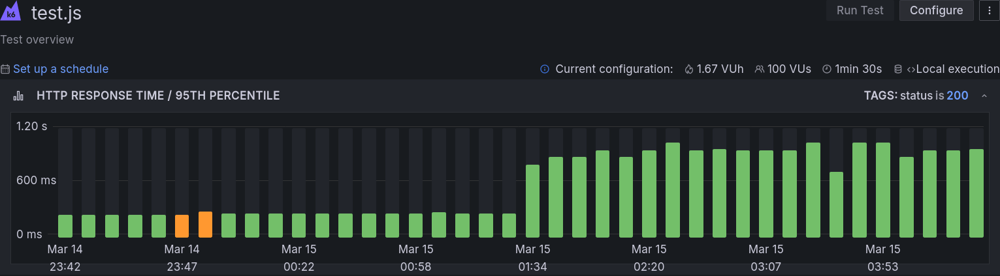
    <p>teste de desempenho - front-end</p>
</div>

o teste acima indica os tempos de resposta para acessar o endpoint / (root) do front-end. até as 1:30 do dia 15 de março, os valores se mantiveram constantes entre 248-291ms, aumentando para valores entre 721-1040ms após esse horário. 

<div style="align:center;text-align:center">
    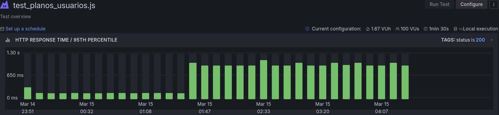
    <p>teste de desempenho - Endpoint /planos_usuarios</p>
</div>

o teste acima indica os tempos de resposta para acessar o endpoint /planos_usuarios. até as 1:30 do dia 15 de março, os valores se mantiveram constantes entre 173-340ms, aumentando para valores entre 889-1040ms após esse horário. 

<div style="align:center;text-align:center">
    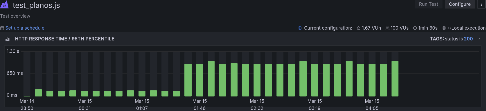
    <p>teste de desempenho - Endpoint /plano</p>
</div>

o teste acima indica os tempos de resposta para acessar o endpoint /plano. até as 1:30 do dia 15 de março, os valores se mantiveram constantes entre 168-213ms, aumentando para valores entre 963-1040ms após esse horário. 

<div style="align:center;text-align:center">
    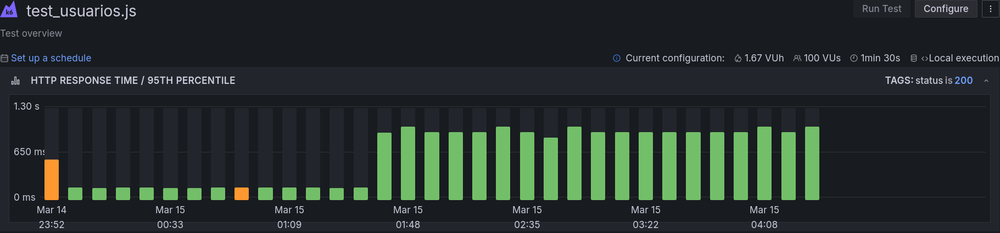
    <p>teste de desempenho - Endpoint /usuario</p>
</div>

o teste acima indica os tempos de resposta para acessar o endpoint /usuario. até as 1:30 do dia 15 de março, os valores se mantiveram constantes entre 173-578ms, aumentando para valores entre 885-1040ms após esse horário. 

<div style="align:center;text-align:center">
    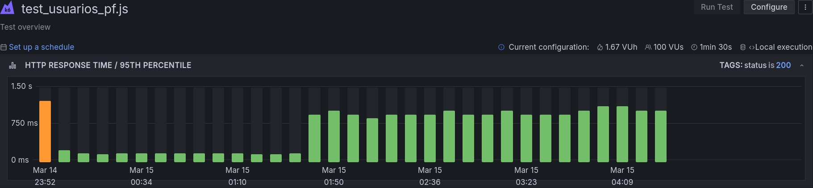
    <p>teste de desempenho - Endpoint /usuario-pf</p>
</div>

o teste acima indica os tempos de resposta para acessar o endpoint /usuario-pf. até as 1:30 do dia 15 de março, os valores se mantiveram constantes entre 171-1023ms, aumentando para valores entre 885-1120ms após esse horário. 

<div style="align:center;text-align:center">
    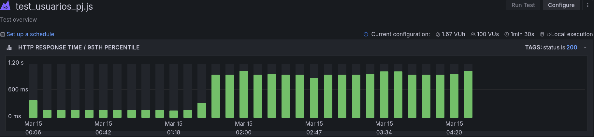
    <p>teste de desempenho - Endpoint /usuario-pj</p>
</div>

o teste acima indica os tempos de resposta para acessar o endpoint /usuario-pj. até as 1:30 do dia 15 de março, os valores se mantiveram constantes entre 173-578ms, aumentando para valores entre 954-1040ms após esse horário. 

### **Caso de teste - RNF3: Capacidade.**

Nesse primeiro momento, para realizar os teste de capacidade utilizou-se da ferramenta K6, onde foi criado 100 usuários virtuais para acessarem a aplicação durante um período de 1 minuto.

<div style="text-align:center">
    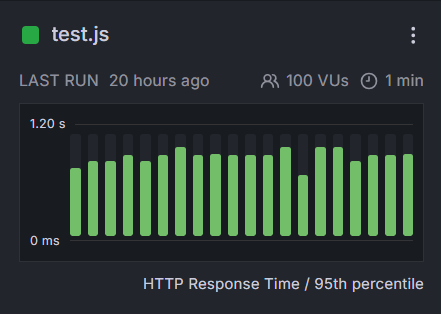
    <p>Teste de Capacidade</p>
</div>


### **Caso de teste - RNF4: Compatibilidade.**

Para o teste de compatibilidade, utilizou-se uma abordagem abrangente para testar a aplicação nos principais navegadores, incluindo Mozilla Firefox, Brave, Google Chrome e Opera

Aplicação no Browser Opera:

<div style="text-align:center">
    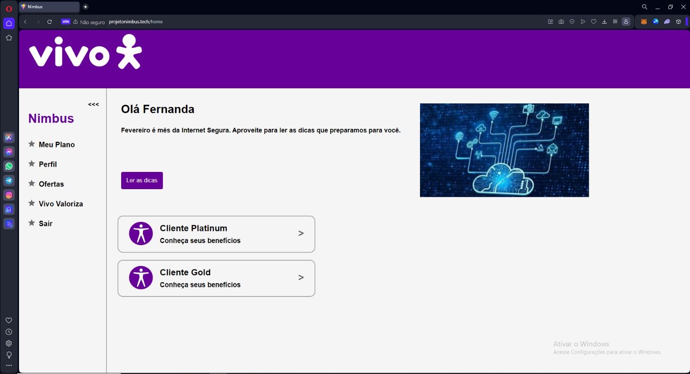
    <p>Navegador Opera</p>
</div>

Aplicação no Firefox:

<div style="text-align:center">
    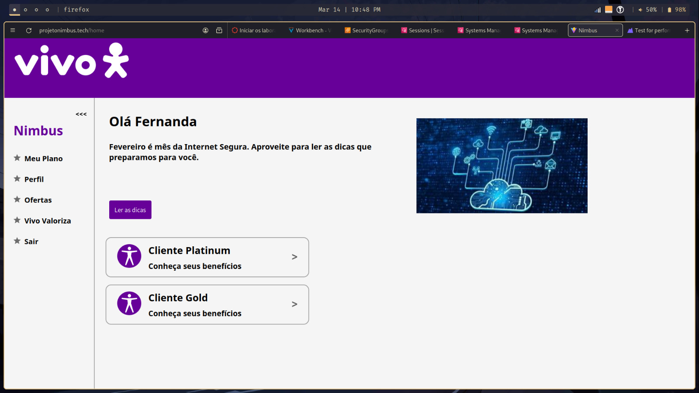
    <p>Navegador Firefox</p>
</div>

Aplicação no Google:

<div style="text-align:center">
    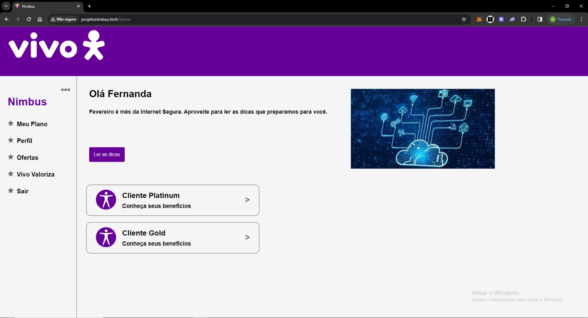
    <p>Navegador Google</p>
</div>


### **Caso de teste - RNF5: Compatibilidade de Sistema Operacional.**

Da mesma forma que foi testada a compatibilidade da aplicação em diferentes navegadores, realizou-se a comptabilidade em sistema operacionais diferentes. No caso, foi testado no Windows e no Arch Linux(Distro do Linux).

Aplicação funcionando no Windows 11

<div style="text-align:center">
    
    <p>Sistema Operacional Windows</p>
</div>

Aplicação funcionando no Arch Linux

<div style="text-align:center">
    
    <p>Sistema Operacional ArchLinux</p>
</div>

### **Caso de teste - RNF6: Usabilidade.**
Para esse requisito funcional, foi feito testes de usabilidade com um grupo de pessoas, onde foi observado as principais ações feita pelos testadores e quais pontos podem melhorar.

#### Objetivo do Teste:
Avaliar a usabilidade do sistema Vivo, abrangendo as funcionalidades apresentadas nas telas de login, cadastro, página principal, plano e perfil.

#### Metodologia:

**Número de participantes:** 3
**Método de teste:** Teste de usabilidade presencial com observação direta.
**Tarefas avaliadas:** Login, cadastro, navegação pela página principal, revisão do plano e verificação de perfil.
**Métricas:** Tempo de conclusão da tarefa, erros cometidos, pedidos de ajuda e feedback qualitativo através de questionário.

#### Participante 1: Ana Carolina
Perfil: 21 anos, estudante universitário, familiarizado com tecnologia.

##### Resultados:
**Cadastro:** Dificuldade em entender os campos de cadastro PF e PJ, levando a um erro inicial. Tempo de conclusão: 2 minutos.
**Login:** Sucesso sem erros. Tempo de conclusão: 30 segundos.
**Página Principal:** Navegação intuitiva, mas tentou acessar banners ou chamadas que estão sem redirecionamento. Tempo de conclusão da revisão da página: 1 minuto.
**Meu Plano:** Fácil compreensão do consumo de dados. Tempo de conclusão: 45 segundos.
**Perfil:** Dificuldade em localizar a opção de edição do perfil. Tempo de conclusão: 1 minuto e 30 segundos.
**Feedback:** "Tive dificuldades de entender o que era clicável ou não, já que cliquei em alguns botões e não levaram a lugar nenhum."

#### Participante 2: Beatriz
Perfil: 16 anos, não tão familiarizada com o uso de tecnologia digital.

##### Resultados:
**Cadastro:** Precisou de ajuda para compreender a diferença entre PF e PJ. Tempo de conclusão: 3 minutos.
**Login:** Várias tentativas até entender o processo. Tempo de conclusão: 3 minutos.
**Página Principal:** Navegou facilmente pela interface, mas tentou acessar botões que deram erro na página. Tempo de conclusão da revisão da página: 2 minutos.
**Meu Plano:** Complicação para entender o gráfico de consumo de dados. Tempo de conclusão: 2 minutos.
**Perfil:** Sem erros, mas lenta na interação. Tempo de conclusão: 2 minutos.
**Feedback:** "A página está bem bonita."

#### Participante 3: Maria Luisa
Perfil: 17 anos, é totalmente familiarizada com o uso de tecnologia digital.

##### Resultados:
**Cadastro:** Deu erro na hora de fazer o cadastro. Tempo de conclusão: 5 minutos.
**Login:** Sucesso sem erros. Tempo de conclusão: 30 segundos.
**Página Principal:** Sem erros. Tempo de conclusão da revisão da página: 30 segundos.
**Meu Plano:** Entendeu o consumo de dados. Tempo de conclusão: 20 segundos.
**Perfil:** Sem erros. Tempo de conclusão: 1 minuto e 30 segundos.
**Feedback:** "Senti que as opções estavam claras, mas teve um momento que deu erro no cadastro e não entendi o motivo."

### Conclusão
Com base nos resultados do teste, identificamos áreas que atendem aos critérios de usabilidade e outras que necessitam de ajustes, como por exemplo mostrar melhor pros usuários os erros que ocorrerem, redirecionar ou não induzir que um botão é clicável caso não tenha nada posteriormente.

## Grafana

O Grafana é um software de código aberto que permite aos usuários criar painéis dinâmicos e ricos em recursos que podem exibir uma ampla variedade de dados de diversas fontes, incluindo bancos de dados, sistemas de monitoramento e serviços de nuvem.

No caso, foram realizados 260 testes entre todos os serviços presentes na nossa aplicação.

<div style="text-align:center">
    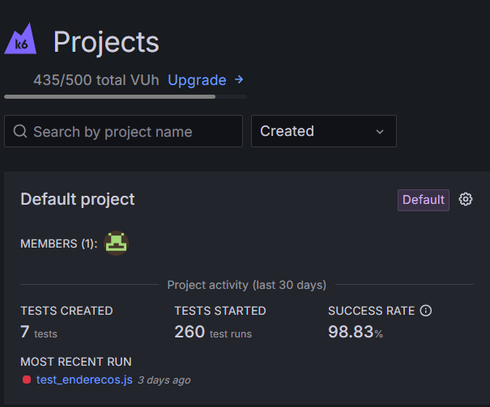
    <p>Testes</p>
</div>

Os serviços que foram testados são: Frontend e todos os microsserviços do Backend(enderecos, planos, planos_usuarios, usuario, usuarios_pf, usuarios_pj).

<div style="text-align:center">
    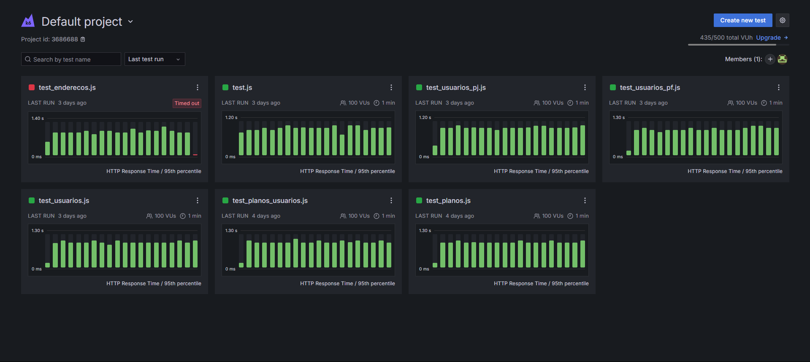
    <p>Todos os testes</p>
</div>

Para facilitar a visualização dos testes, foi selecionado a bateria de testes relacionado ao frontend.

<div style="text-align:center">
    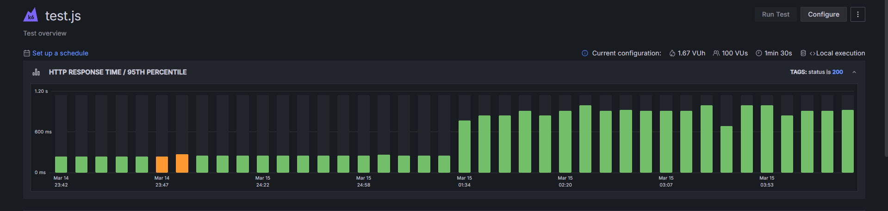
    <p>Testes do Frontend</p>
</div>

Para o front-end, foram feitas 40 baterias de testes. É possível observar que os primeiros testes obtiveram um tempo de resposta de aproximadamente 250 milissegundos. Entretanto, a partir das 1:34, é perceptível um aumento no tempo de resposta para 1000 milissegundos.

<div style="text-align:center">
    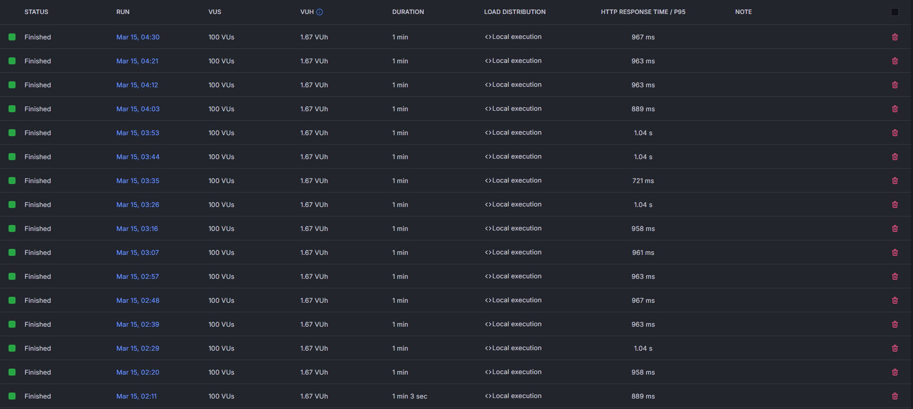
    <p>Baterias de testes do Frontend</p>
</div>

Para ilustrar o desempenho observado, vamos apresentar os resultados de um teste específico. Esse relatório incluirá o total de requisições executadas durante o teste, a duração total do mesmo, e uma divisão entre as requisições que foram completadas com sucesso e aquelas que resultaram em falha.

<div style="text-align:center">
    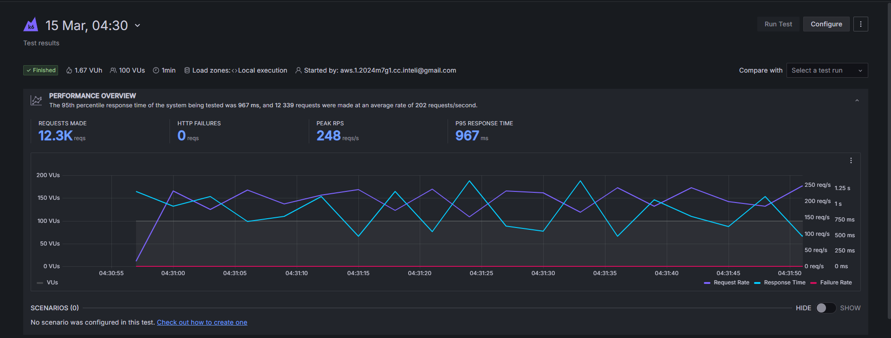
    <p>Análise dos resultados</p>
</div>

É possível observar que houve 12.300 requisições realizadas em um período de 1 minuto, onde o pico médio foi de 248 requisições por segundo, em que o tempo de resposta foi de 962 milissegundos, aproximadamente 1 segundo. Além disso, o Grafana também disponibiliza uma série de métricas relacionadas aos testes, como: Tempo de Resposta, Quantidade de Interações, Duração das Interações, Número de Usuários Utilizados nos Testes, Taxa de Requisições.

<div style="text-align:center">
    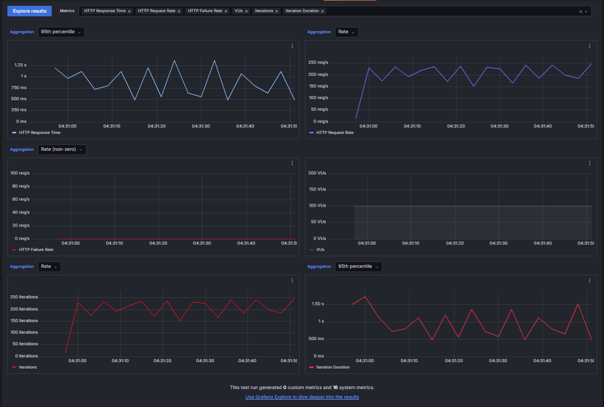
    <p>Métricas dos resultados</p>
</div>

### Novos Testes.

<div style="text-align:center">
    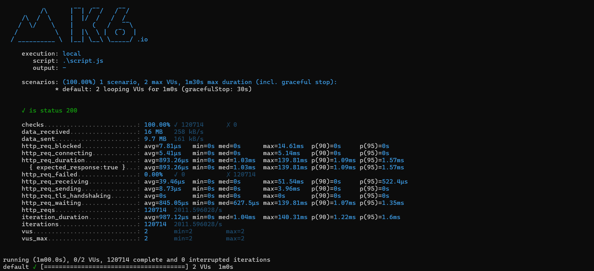
    <p>Primeiro Teste na nova API</p>
</div>


Após a implementação do Barramento e do Elastic Cache, juntamente com o banco de dados em memória Redis, foi realizado novas bateria de testes com o objetivo de visualizar o tempo de resposta desses novos componentes da aplicação.

<div style="text-align:center">
    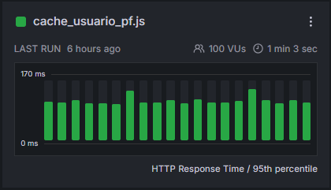
    <p>Bateria de testes</p>
</div>

A primeira bateria de testes foi realizada no cache, mais especificamente no endpoint /usuario_pf, responsável pelos usuários Pessoa Física. Foram realizados 18 testes no total, cada um com um tempo médio de 1 minuto e 3 segundos, e 100 máquinas virtuais efetuando entre 100 mil a 120 mil requisições por teste.

<div style="text-align:center">
    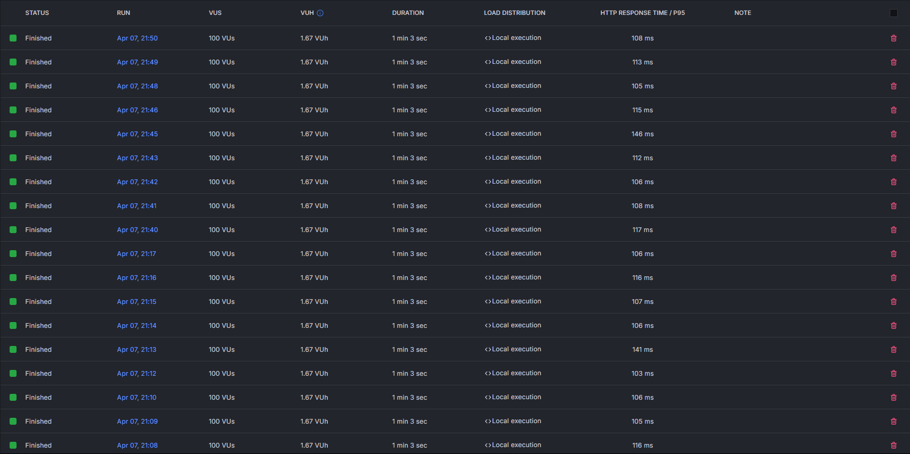
    <p>Bateria de testes</p>
</div>

Para visualizar melhor o resultado, escolheremos um dos testes da bateria realizada.

Nesse caso, podemos ver que foram efetuadas 146.600 requisições em um tempo médio de 1 minuto e 3 segundos. Dentre os testes, não foram obtidas falhas, e o tempo de resposta foi de 108 ms, correspondendo a 2.082 requisições por segundo.

<div style="text-align:center">
    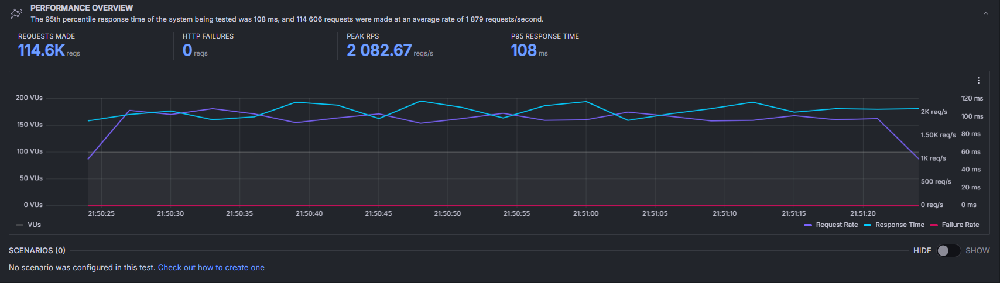
    <p>Métricas do teste</p>
</div>

Além dos testes feitos no endpoint /usuario_pf, uma bateria de testes foi realizada na nova API.

<div style="text-align:center">
    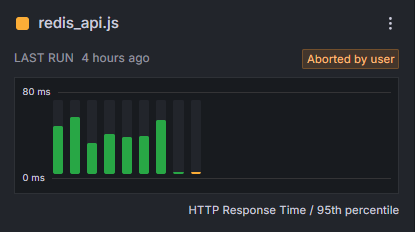
    <p>Testes na nova API</p>
</div>

A quantidade de testes foi menor em comparação com os outros serviços. Entretanto, a nova API obteve o melhor resultado, alcançando, em média, de 200 a 300 mil requisições em 1 minuto e 3 segundos.

<div style="text-align:center">
    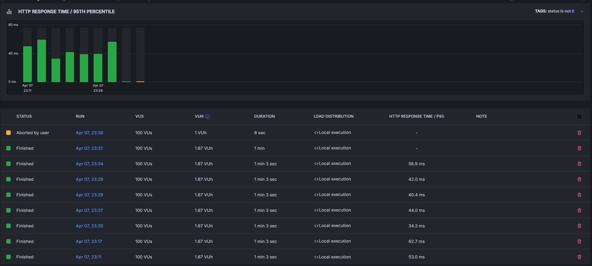
    <p>Bateria de testes da nova API</p>
</div>

Escolhendo um dos testes, podemos visualizar que foram efetuadas 278 mil requisições em 1 minuto. Tivemos um pico de 7.251 requisições por segundo, e o tempo de resposta do teste foi de 42 ms.

<div style="text-align:center">
    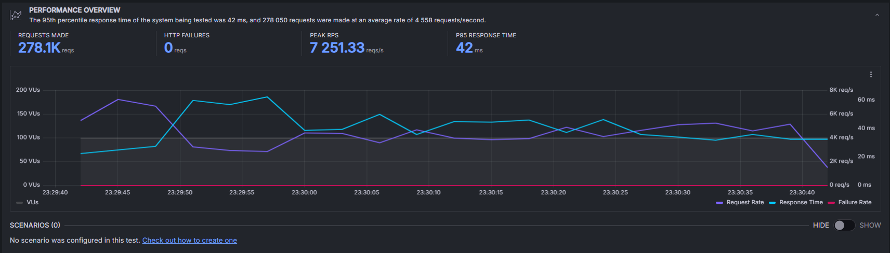
    <p>Teste na nova API</p>
</div>
