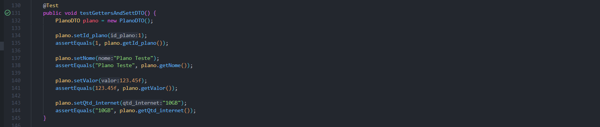

# Testes do Sistema

## Testes de Microsserviço

### Introdução
Este documento apresenta a documentação dos testes realizados na aplicação em nuvem desenvolvida pelo grupo. Os testes são conduzidos com o objetivo de verificar o comportamento correto das funcionalidades oferecidas pela aplicação, garantindo que ela atenda aos requisitos especificados e mantenha a integridade dos dados.

### Objetivo
O principal objetivo dos testes na aplicação é garantir a qualidade do software, identificando possíveis falhas e garantindo que todas as funcionalidades estejam operacionais e forneçam resultados esperados.

### Escopo
Os testes abrangem as principais operações oferecidas pelos microsserviços da aplicação, incluindo a criação, recuperação, atualização e exclusão de planos de usuários. Cada operação é testada individualmente para garantir que funcione conforme o esperado em diferentes cenários.

### Metodologia
Os testes são implementados utilizando a estrutura de teste fornecida pelo framework Spring Boot e são executados automaticamente durante o processo de integração contínua. Cada teste é projetado para simular uma interação com a API REST da aplicação e verificar se o comportamento resultante está de acordo com as expectativas.

### Estrutura de Testes
Os testes são estruturados em classes Java localizadas no pacote com.example.planos_usuarios. Cada classe de teste corresponde a uma entidade ou a um conjunto específico de operações a serem testadas. Os testes são executados utilizando o MockMvc para simular requisições HTTP e validar as respostas recebidas.

### Execução dos Testes
Os testes podem ser executados automaticamente durante o processo de compilação e empacotamento da aplicação utilizando ferramentas de integração contínua.

### Teste do Microsserviço Endereços
<div style="text-align:center">
    
    <p>Teste Springboot Endereços</p>
    Testes passados: 5/5
</div>

### Teste do Microsserviço Plano
<div style="text-align:center">
    
    <p>Teste Springboot Plano</p>
    Testes passados: 7/7
</div>

### Teste do Microsserviço Usuário
<div style="text-align:center">
    
    <p>Teste Springboot Usuário</p>
    Testes passados: 7/7
</div>

### Teste do Microsserviço Plano-Usuário
<div style="text-align:center">
    
    <p>Teste Springboot Plano-Usuário</p>
    Testes passados: 7/7
</div>

### Teste do Microsserviço Usuário PF
<div style="text-align:center">
    
    <p>Teste Springboot Usuário PF</p>
    Testes passados: 7/7
</div>

### Teste do Microsserviço Usuário PJ
<div style="text-align:center">
    
    <p>Teste Springboot Usuário PJ</p>
    Testes passados: 7/7
</div>

### Conclusão

Os testes de microsserviços foram especialmente bem-sucedidos ao validar a interação entre os diversos componentes da aplicação, garantindo que cada microsserviço cumpra sua função de forma isolada e também em conjunto com os demais. Isso foi alcançado por meio da simulação de requisições HTTP utilizando o MockMvc, o que permitiu testar as respostas dos endpoints da API REST de maneira detalhada e precisa.
## Testes Unitários

Os testes unitários tem como objetivo verificar que cada unidade do software execute sua função conforme esperado. Os testes unitários são caracterizados por serem automatizados, rápidos de executar e repetíveis.

Como nosso backend foi construído com Java, optou-se pela utilização da biblioteca Junit para realizar e automatizar os testes.

### Testes Unitários dos Endereços.

Todos os testes foram feitos em relação a Service de cada microsserviço.

Nesse primeiro teste, foi verificado a função de GET, para ver se os endereços estão sendo retornado.

Função: getEndereco()

<p align="center">
  
</p>

No segundo teste, foi testando a funcionalidade de retornar um endereço específico por meio de um Id(Identificador).

Função: geetEnderecosbyId()

<p align="center">
  
</p>

No terceiro testes, foi realizando o teste do serviço de criação de um endereço.

Função: createEnderecoPJ

<p align="center">
  
</p>

O quarto teste foi a funcionalidade de deletar um endereço existente.

Função: deleteEnderecoPJ()

<p align="center">
  
</p>

O quinto teste foi em relação a funcionalidade de atualizar algum endereço já existente. 

Função: updateEnderecoPJ

<p align="center">
  
</p>

Além da Service, foi testado a criação de novas Entities. No caso foi testado o mecanismo de Getter and Setters das entidades do microsserviço.

<p align="center">
  
</p>

Por fim, temos um print demonstrando todos os resultados dos testes realizados anteriormente. É possível visualizar, que todos os testes que foram executados retornaram com um "check" verde, simbolizando que os testes foram bem sucedidos.

<p align="center">
  
</p>

### Testes Unitários dos Planos

Todos os testes foram feitos em relação a Service do microsserviço Planos.

Nesse primeiro teste, foi verificado a função de GET, para ver se todos os planos estão sendo retornado.

Função: getPlanos();

<p align="center">
  
</p>

Em seguida, no segundo teste, testou-se a mesma função que o primeiro teste. Porém, o teste era para um identificador específico

Função: getPlanoById()

<p align="center">
  
</p>

No terceiro teste, foi testado a função createPlano() que tem como objetivo criar um Plano.

<p align="center">
  
</p>

No quarto teste. Testou-se a funcionalidade de deletar um plano, chamando a função deletePlano().

<p align="center">
  
</p>

No quinto teste, a funcionalidade testada foi a de Update, por meio da função updatePlano().

<p align="center">
  
</p>

No sexto e no setimo teste foram testando as opções de Getter and Setters, tanto da Entity, quanto do DTO.

<p align="center">
  
</p>

<p align="center">
  
</p>

Por fim, é possível visualizar que todos os testes passaram com sucesso.

<p align="center">
  
</p>


## Testes de Integração

Os testes de integração são testes responsáveis por garantir a funcionalidade e a confiabilidade do sistema, assegurando que os componentes da aplicação possam ser combinados, permitindo a operação de maneira íntegra e conforme o esperado.

O objetivo dos testes de integração é verificar a comunicação entre o frontend e o backend da aplicação, visualizando se a comunicação ocorre de maneira fluída e sem erros.

### Teste 1: Criação de Usuário Pessoa Física.  

Esse teste tem como objetivo criar um novo usuário Pessoa Física.

Para isso temos a página principal. Como o usuário ainda não possui uma conta, ele deve acessar a página de cadastro.

<p align="center">
  
</p>

Acessando a página de cadastro, ele terá que escolher entre Pessoa Física ou Pessoa Jurídica.

<p align="center">
  
</p>

Selecionando a opção de Pessoa Física, o usuário será direcionado para um formulário.

<p align="center">
  
</p>

O usuário deverá preencher esse formulário com suas informações. Após preencher e clicar no botão Enviar, será realizado uma requisição POST para o endpoint /usuario_pf enviando um json:

```
    {
        "cpf": "98765432100",
        "nome": "Teste de Integração",
        "rg": "474569718",
        "senha": "testedeintegracao",
        "data_nascimento": "2024-03-01"
    }
```

<p align="center">
  
</p>

Depois de enviar a requisição, o usuário será direcionado para a página Home, na qual ocorre uma requisição GET para o endpoint /usuarios_pf/${cpf}. Essa requisição tem como objetivo buscar algumas informações referentes ao usuário, por exemplo: Nome.

<p align="center">
  
</p>

Para verificarmos se a conta realmente foi criada, podemos visualizar na ferramenta Postman.

<p align="center">
  
</p>

### Teste 2: Criação de Usuário Pessoa Jurídica.

Esse teste tem como objetivo criar um novo usuário Pessoa Jurídica.

Para isso, temos a página principal, como o usuário ainda não possui uma conta, ele deve acessar a página de cadastro.

<p align="center">
  
</p>

Acessando a página de cadastro, ele terá que escolher entre Pessoa Física ou Pessoa Jurídica.

<p align="center">
  
</p>

Selecionando a opção de Pessoa Jurídica, o usuário será direcionado para um formulário.

<p align="center">
  
</p>

O usuário (Pessoa Jurídica) deverá preencher esse formulário com suas informações. Após preencher e clicar no botão Enviar, será realizado uma requisição POST para o endpoint /usuario_pj enviando um json:

```
{
  "cnpj": "420237057",
  "razao_social": "Inteli",
  "email": "inteli@gmail.com",
  "senha": "inteli",
  "data_nascimento": "2024-03-19"
}
```

<p align="center">
  
</p>

Depois de enviar a requisição, o usuário será direcionado para a página Home, na qual ocorre uma requisição GET para o endpoint /usuarios_pf/${cnpj}. Essa requisição tem como objetivo buscar algumas informações referentes ao usuário pessoa jurídica, por exemplo: Nome.

<p align="center">
  
</p>


Para verificarmos se a conta pessoa jurídica realmente foi criada, podemos visualizar na ferramenta Postman.

<p align="center">
  
</p>

### Teste 3 - Visualizar a página de perfil

Para conseguir acessar a página de perfil é necessário estar logado em uma conta. No caso, foi testado com a conta criada no "Teste 1" dos testes de integração.

<p align="center">
  
</p>

Ao acessar a página de Perfil é realizado uma requisição GET no endpoint /usuario_pf/${cpf}. As informações obtidas pela requisição são expostas na página do Perfil.

<p align="center">
  
</p>

As seguintes informações foram obtidas pela requisição GET.

```
    {
        "cpf": "98765432100",
        "nome": "Teste de Integração ",
        "rg": "474569718",
        "senha": "testedeintegracao",
        "data_nascimento": "2024-03-01",
        "id_usuario": 0
    }
```

### Teste 4: Visualizar a página de planos.

Assim como o teste 3 foi conduzido utilizando a conta criada durante o teste 1, o teste 4 também seguirá este procedimento, utilizando a mesma conta.

<p align="center">
  
</p>

Ao clicar na parte "Meu Plano", o usuário será direcionado para a página do plano. Na página do plano será feita uma requisição GET para o endpoint /planos_usuarios/${cpf}

<p align="center">
  
</p>

Nessa página a requisição GET retorna o seguinte json com as informações referentes ao plano do usuário.

```
{
    "contrato": 1,
    "id_plano": 1,
    "qtd_internet_consumido": "2GB",
    "qtd_internet_restante": "8GB",
    "data_inicio": 1672531200000,
    "data_final": 1703980800000,
    "fatura": 99.99,
    "telefone": "11987654321",
    "status": "ativo",
    "id_endereco": 1,
    "id_usuario": 0
}
```

No caso, os dados que são visualizados na página "Meu plano" é a quantidade de internet consumida, quantidade de internet restante e o telefone referente ao plano.
